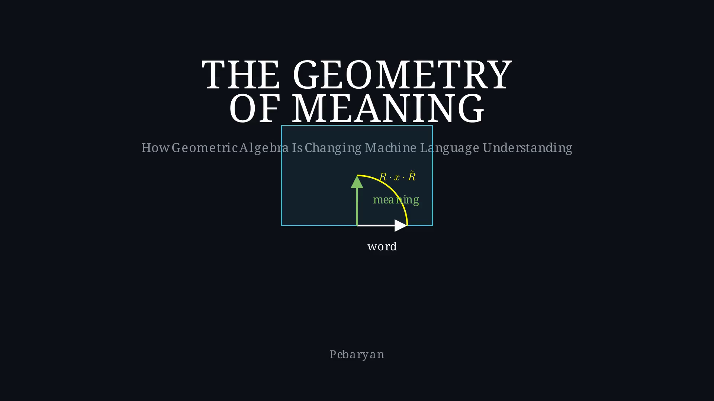

# The Geometry of Meaning

*How Geometric Algebra Is Changing the Way Machines Understand Language*

An accessible book-length introduction to Geometric Algebra (GA) and its applications to language modeling, written for a general audience. No advanced math required — just curiosity and basic vector concepts.

## What's Inside

| Ch | Title | Focus |
|----|-------|-------|
| — | [Frontmatter](chapters/00-frontmatter.md) | Introduction |
| 1 | [The Vector Revolution](chapters/01-vector-revolution.md) | Embeddings, from one-hot to subword tokenization |
| 2 | [Traveling the World](chapters/02-universe-on-a-sphere.md) | The hypersphere, SLERP, and spherical geometry |
| 3 | [The Algebra We Forgot](chapters/03-algebra-we-forgot.md) | Geometric Algebra fundamentals |
| 4 | [Rotors: The Engine of Change](chapters/04-rotors.md) | Rotations in GA |
| 5 | [The Attention Mechanism](chapters/05-attention-mechanism.md) | How transformers focus, and their linear limitation |
| 6 | [Explorations](chapters/06-ga-ml-landscape.md) | How others apply GA (GATr, GAFL, FGA) |
| 7 | [Three Projects](chapters/07-three-projects.md) | gaflowlm, gattrlm, gamuon — our research |
| 8 | [The Multivector Hypothesis](chapters/08-multivector-hypothesis.md) | Language as geometric algebra |
| 9 | [The Roadmap](chapters/09-roadmap.md) | Where we go from here |
| 10 | [A Personal Note](chapters/10-personal-note.md) | Getting started with GA |

## Book Structure

The book follows a learning progression:

- **Chapters 1-4**: Foundations — from familiar concepts (embeddings, attention) to GA machinery (multivectors, rotors)
- **Chapters 5-7**: The Landscape — how GA is being applied, by others and by us
- **Chapters 8-10**: The Hypothesis — what language might *be*, and how to test it

## Projects Covered

This book draws on both published research and active open-source projects:

- **[gaflowlm](https://github.com/pebaryan/gaflowlm)** — Rotor-based flow matching for language modeling
- **[gattrlm](https://github.com/pebaryan/gattrlm)** — Clifford attractor models (DEQ + GA)
- **[gamuon](https://github.com/pebaryan/gamuon)** — GA reformulation of the Muon optimizer

And key external works: GATr (Qualcomm), GAFL (HITS), FGA (Pustejovsky), CliffordNet, and more.

## Visualizations

Each chapter includes Manim visualizations (43 total across Chapters 1-9):

- Chapter 1: 7 illustrations (embeddings, Zipf's law, tokenization)
- Chapter 2: 5 illustrations (hypersphere, SLERP, journeys)
- Chapter 3: 4 illustrations (geometric product, bivectors, trivectors)
- Chapter 4: 6 illustrations (rotors, sandwich product, quaternions)
- Chapter 5: 4 illustrations (Q/K/V, attention scores, multi-head, GA comparison)
- Chapter 6: 4 illustrations (3D symmetry, structured generation, composition)
- Chapter 7: 4 illustrations (hidden information, breakthrough, memory, stack)
- Chapter 8: 4 illustrations (red car, vocabulary, rotor vs offset, CFA)
- Chapter 9: 3 illustrations (integrated stack, roadmap, open questions)

## Status

Complete first draft (May 2026). All chapters written with full Manim illustration sets. Open to revisions based on reader feedback.

## License

[To be determined]
