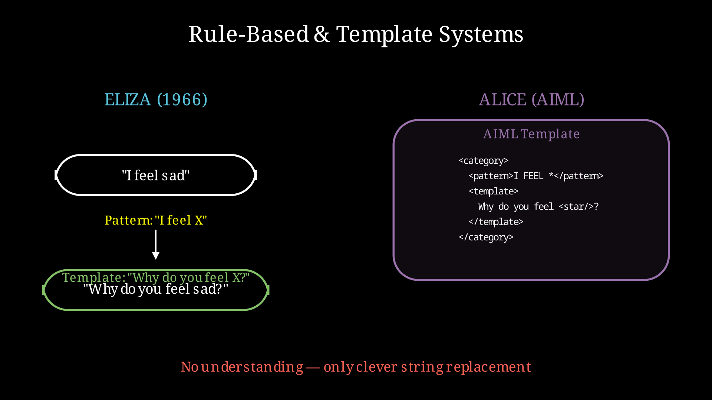
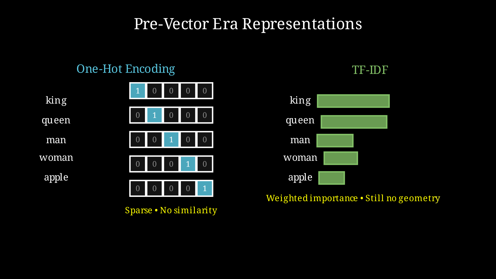
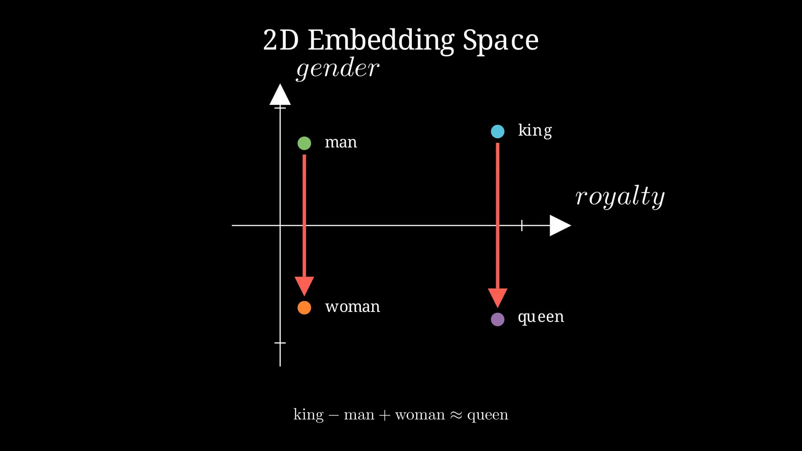

## 1. The Vector Revolution

Before we talk about Geometric Algebra, we need to understand a quiet revolution that happened in computer science over the last decade.

Machines don't understand words. They never have.

But they've learned something surprisingly close: they've learned to *place* words in space.

### How Computers Used to Process Language

Before dense vectors, computers handled language in much more rigid, symbolic ways.

In the early days of natural language processing, language was treated as a set of rules and symbols. Systems like ELIZA (1966) used pattern matching and substitution rules. Later statistical approaches such as n-gram models simply counted how often words appeared next to each other. These systems could generate fluent text but had no real understanding of meaning.



When neural networks entered the picture, the first approach was **one-hot encoding**. Each word was represented as a long vector of zeros with a single "1". This had two fatal problems: the vectors were extremely sparse, and there was no notion of similarity between words.

Bag-of-words and TF-IDF improved on this by weighting words according to importance, but they still treated words as independent atomic symbols with no geometry or relationships.



This was the world before the vector revolution.

### The Vector Revolution

Every word in your vocabulary can now be represented as a point in a high-dimensional space. This is called a **word embedding**, and it's one of the most important ideas in modern AI.

### Why Embeddings Work

The magic is in the geometry. In this space, words that are related are *close together*. More remarkably, the *relationships* between words show up as geometric patterns.

Consider a simple 2D analogy with two axes: "royalty" and "gender":

- "king" might sit at (0.9, 0.8)
- "queen" at (0.9, -0.8)
- "man" at (0.1, 0.7)
- "woman" at (0.1, -0.7)

The vector from "king" to "queen" is roughly a downward shift in the gender direction. The vector from "man" to "woman" is almost identical. This is why the famous equation works:



```
king - man + woman ≈ queen
```

You're performing a **geometric transformation** in meaning space.

### The Power and the Problem

Vectors capture meaning through their *positions and directions*. Language models are built on this foundation.

But vectors are surprisingly poor at representing *relationships*, *transformations*, and *compositions* — the very things language does constantly.

And Geometric Algebra offers a way forward.

---