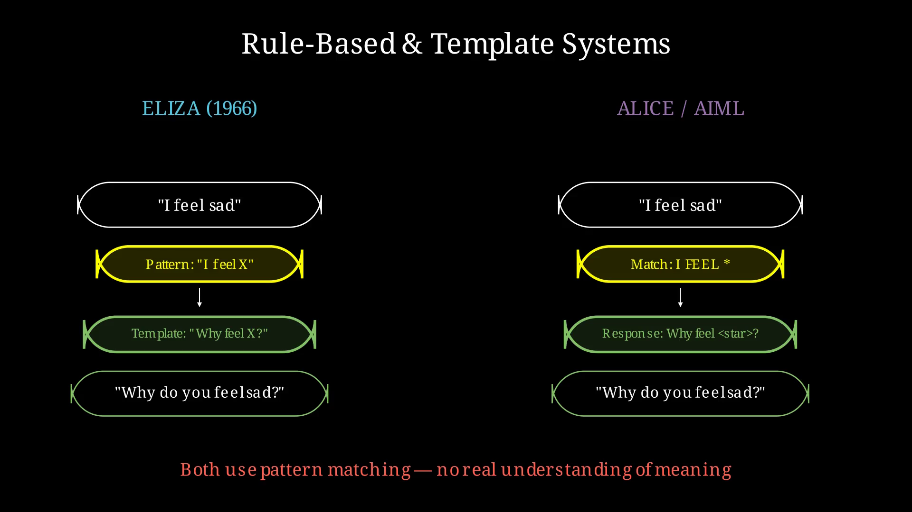
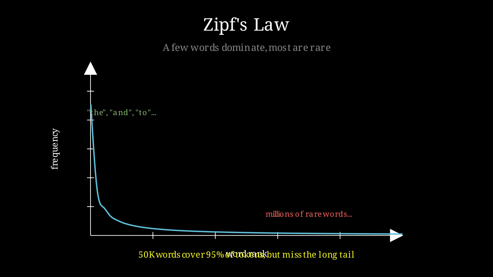
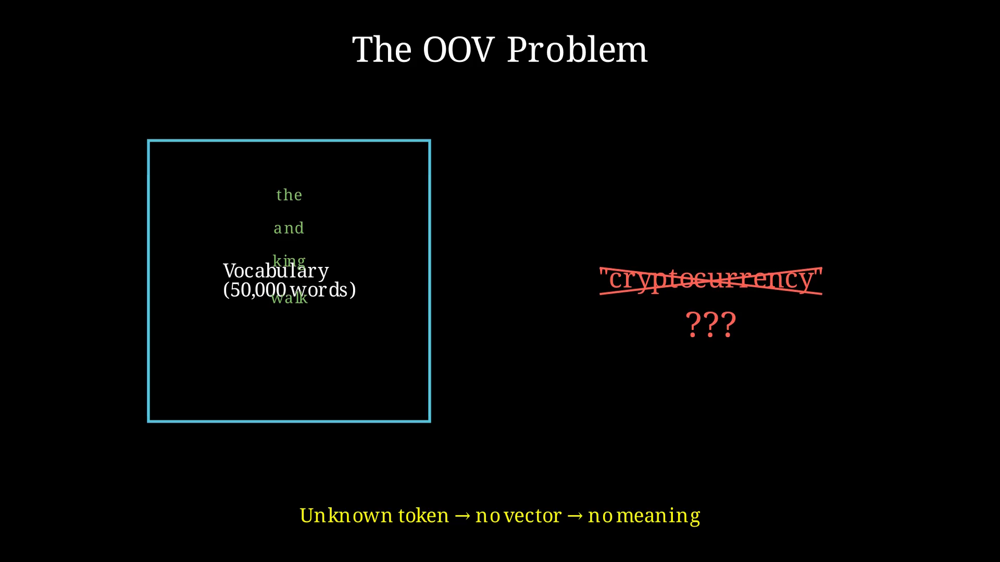
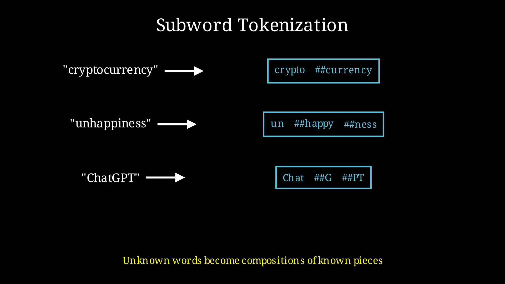
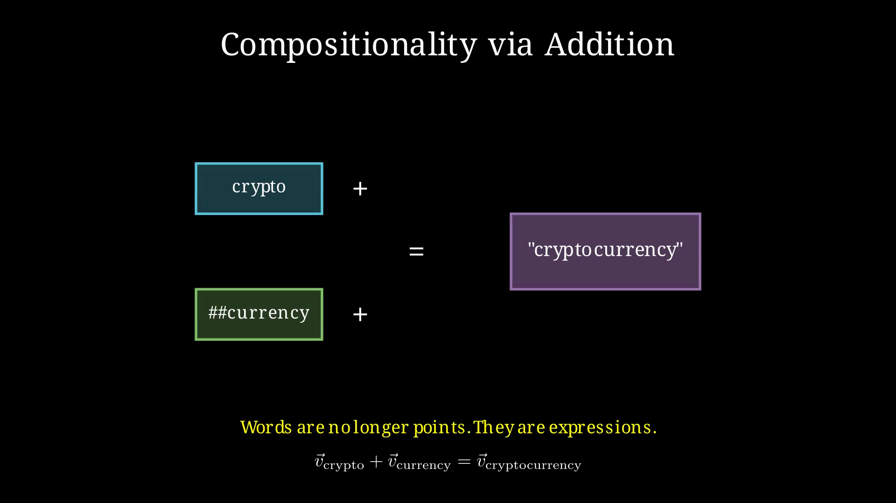

## 1. The Vector Revolution

Before we talk about Geometric Algebra, we need to understand a quiet revolution that happened in computer science over the last decade.

Machines don't understand words. They never have.

But they've learned something surprisingly close: they've learned to *place* words in space.

### How Computers Used to Process Language

Before dense vectors, computers handled language in much more rigid, symbolic ways.

In the early days of natural language processing, language was treated as a set of rules and symbols. Systems like ELIZA (1966) used pattern matching and substitution rules. ALICE/AIML formalized this approach with XML:

```xml
<category>
  <pattern>I FEEL *</pattern>
  <template>Why do you feel <star/>?</template>
</category>
```

Later statistical approaches such as n-gram models simply counted how often words appeared next to each other. These systems could generate fluent text but had no real understanding of meaning.



When neural networks entered the picture, the first approach was **one-hot encoding**. Each word was represented as a long vector of zeros with a single "1". This had two fatal problems: the vectors were extremely sparse, and there was no notion of similarity between words.

Bag-of-words and TF-IDF improved on this by weighting words according to importance, but they still treated words as independent atomic symbols with no geometry or relationships.


This was the world before the vector revolution.

### The Vector Revolution

The breakthrough came from a simple idea: **distributional semantics**. The words that appear together in text tend to have related meanings. "King" appears near "queen," "royal," and "castle." "Dog" appears near "puppy," "bark," and "leash.

If we train a neural network to predict which words appear near each other, something remarkable happens. The network learns to represent each word as a dense vector—typically 100 to 1,000 dimensions—where similar words end up close together. These are called **word embeddings**.

Unlike one-hot vectors, embeddings capture meaning through *geometry*. Words that appear in similar contexts get similar vectors. The result is a continuous space where "king" and "queen" are neighbors, and the relationships between words become mathematical operations.

### Why Embeddings Work

The magic is in the geometry. In this space, words that are related are *close together*. More remarkably, the *relationships* between words show up as geometric patterns.

Consider a simple 2D analogy with two axes: "royalty" and "gender":

- "king" might sit at (0.9, 0.8)
- "queen" at (0.9, -0.8)
- "man" at (0.1, 0.7)
- "woman" at (0.1, -0.7)

The vector from "king" to "queen" is roughly a downward shift in the gender direction. The vector from "man" to "woman" is almost identical. This is why the famous equation works:


```
king - man + woman ≈ queen
```

You're performing a **geometric transformation** in meaning space. The relationship "royalty with gender flipped" is captured as a direction you can add or subtract.

### The Vocabulary Problem

Word embeddings have a serious limitation: **out-of-vocabulary words**. If your training corpus never contained "cryptocurrency," your model has no vector for it. Every new proper noun, technical term, or misspelling becomes an unknown token.

This hits harder than you'd expect. Language follows Zipf's law: a few words appear constantly, but most appear rarely. Your vocabulary of 50,000 words might cover 95% of tokens, but the remaining 5% includes millions of distinct words. In practice, word-level models face unknown tokens constantly.



The solution was **subword tokenization**. Instead of embedding whole words, modern models embed smaller pieces. BERT uses WordPiece; GPT uses Byte-Pair Encoding (BPE). These algorithms learn to split words into frequent substrings:



```
"cryptocurrency" -> ["crypto", "##currency"]
"unhappiness" -> ["un", "##happy", "##ness"]
"ChatGPT" -> ["Chat", "##G", "##PT"]
```

Now the model can represent any word by composing subword vectors. A word it has never seen can still be understood from its parts.



This is **compositionality through addition**: the vector for "cryptocurrency" becomes the sum of "crypto" and "currency" vectors.



But notice what happened. We replaced atomic word vectors with composite representations. The embedding for a word is no longer a single point in space—it's a *sum* of vectors. We moved from representing words as points to representing them as expressions.

Geometric Algebra will take this insight further.

### The Power and the Problem

Vectors capture meaning through their *positions and directions*. Language models— the things that power ChatGPT, Claude, Gemini—are built on this foundation. They take sequences of these word-vectors and learn to predict what comes next.

But there's a fundamental limitation. Vectors are excellent at representing *points* and *directions*, but they're surprisingly poor at representing *relationships*, *transformations*, and *compositions*—the very things language does constantly.

Think about it: the vector offset from "king" to "queen" works for gender, but what about tense? "Walk" to "walked" is a different transformation entirely. And what about negation? "Happy" to "not happy" isn't a simple vector flip. The geometric operations we need don't fit naturally in vector space.

Geometric Algebra offers a way forward—one where the math matches the structure of language itself.

---