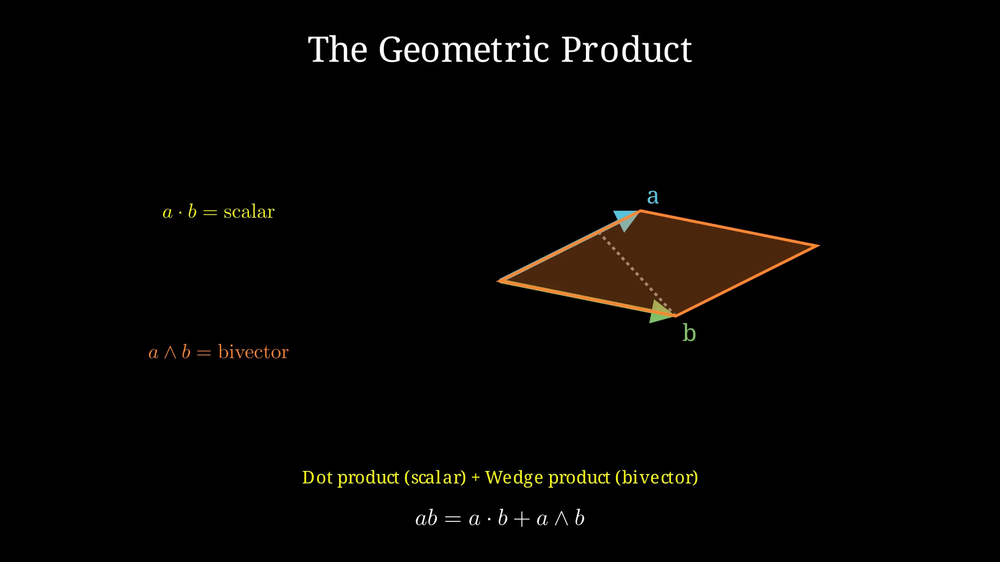
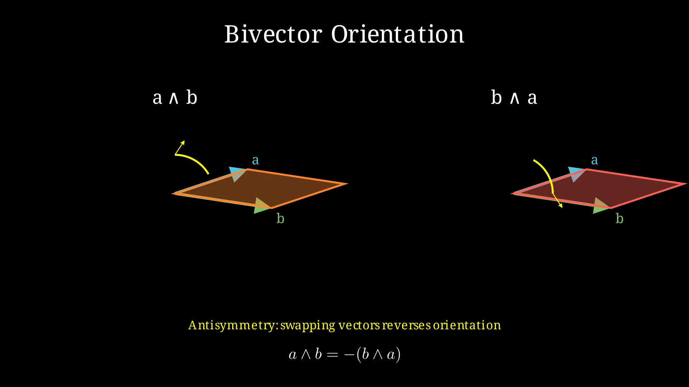
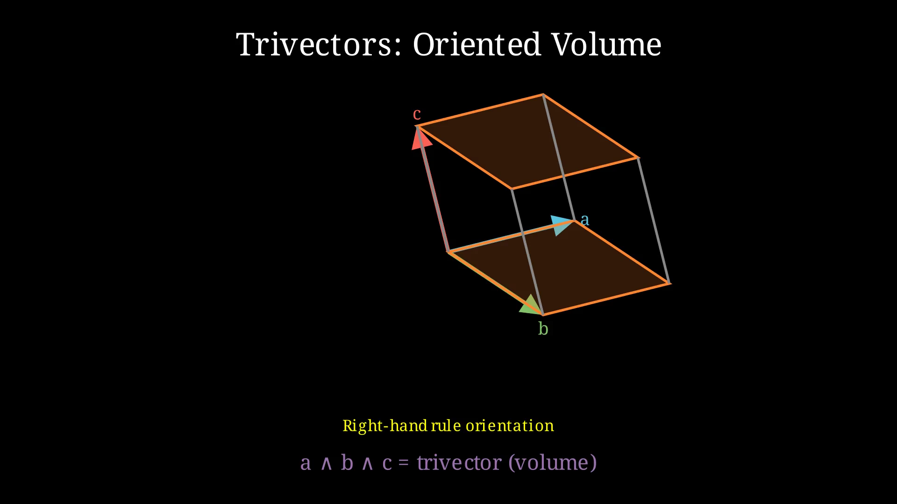
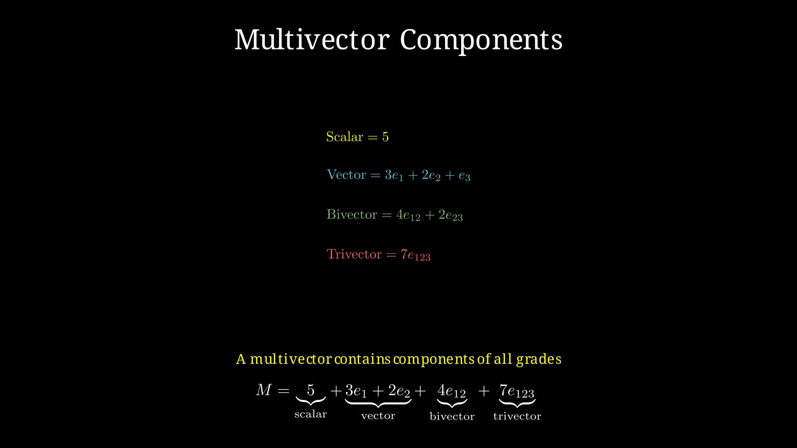

## 3. The Algebra We Forgot

Geometric Algebra (GA) was discovered — or rather, *re-discovered* — by the English mathematician William Kingdon Clifford in 1878. He died young (33), but his ideas were so ahead of their time that they're only now finding their natural home in machine learning.

The core idea is deceptively simple: **what if we could multiply vectors together?**

In school, we learn two ways to multiply vectors:
- The **dot product** (a·b): gives a number. "How much do these vectors point the same way?"
- The **cross product** (a×b): gives a vector perpendicular to both. Only works in 3D.

Clifford asked: what if we keep *both* pieces of information? The dot product captures alignment; the cross product captures oriented area. Why choose?

### The Geometric Product

His insight was the **geometric product**:

```
ab = a·b + a∧b
```

The first part (a·b) is the dot product — a number. The second part (a∧b) is the *wedge product* — a new kind of object called a **bivector**, representing the oriented plane swept out by a and b.



Instead of trying to visualize this with ASCII, here is a proper 3D animation that shows exactly how it works:

> **▶ Watch the 3D visualization**: [ch3_ga_visualization.mp4](../visualizations/ch3_ga_visualization.mp4)
> It demonstrates the geometric product, bivector orientation (including why a∧b = −b∧a), and how trivectors represent oriented volumes. The camera rotates around each object so you can see the geometry clearly.

This might seem like a small change, but it unlocks an entirely new mathematical universe. You can keep multiplying vectors and get higher-dimensional objects: **trivectors** (oriented volumes), **quadvectors**, and so on. These are all **multivectors** — the fundamental objects in Geometric Algebra.



The antisymmetry of the wedge product — that a∧b = −(b∧a) — is fundamental. Swapping the order of vectors reverses the orientation of the resulting bivector.



Three vectors combine to form a trivector, representing an oriented volume. The right-hand rule determines the orientation.

### Why This Matters for Language

A multivector lives in a space of 2^k dimensions, where k is the dimensionality of your original space. Because it doesn't just store the coordinates of a point — it stores scalars, vectors, planes, volumes, and more, all in a single unified mathematical object.

To make these abstract objects more concrete, the book includes a short 3D animation that visualizes exactly how the geometric product works in practice. You can watch the dot product project one vector onto another, the wedge product sweep out an oriented parallelogram (the bivector), and how three vectors combine to form a trivector with volume and orientation. The animation also demonstrates the critical antisymmetry of the wedge product — that a∧b is the negative of b∧a — which is fundamental to how Geometric Algebra handles oriented quantities.



A single multivector can contain scalars, vectors, bivectors, and trivectors — all the geometric information about a point and its surrounding space.

The video is available in the `../visualizations/` folder, along with the Manim source code if you want to explore or modify the scenes yourself.

---