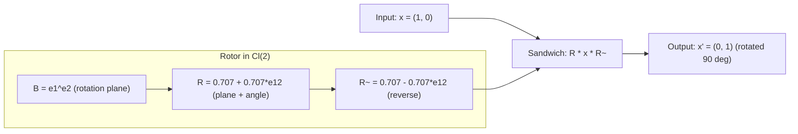

## 4. Rotors: The Engine of Change

If bivectors represent oriented planes, they're also the key to describing rotations.

In Geometric Algebra, a rotation is performed by a **rotor** — a special kind of multivector that encodes the rotation plane and angle. The rotor is built from a bivector using exponentiation:

```
R = exp(B/2)
```

Where B is a bivector representing the rotation plane and angle.

To rotate a vector x, you use the **sandwich product**:

```
x' = R x R̃
```

Where R̃ is the reverse of R (like a conjugate). The sandwich wraps around x, applies the rotation, and gives you the result.

### A Concrete Rotation

Let's see this in 2D, where the math is simplest. Suppose we want to rotate the vector x = (1, 0) — pointing east — by 90 degrees counterclockwise. The result should be (0, 1) — pointing north.

In 2D, there's only one plane: the xy-plane. The bivector representing this plane is e₁∧e₂ (often called the pseudoscalar in 2D). To rotate by 90 degrees (θ = π/2), we build the rotor:

```
R = exp((π/4) · e₁∧e₂) = cos(π/4) + sin(π/4) · e₁∧e₂
  = 0.707 + 0.707 · e₁∧e₂
```

Now apply the sandwich:

```
x' = R · (1, 0) · R̃
   = (0.707 + 0.707·e₁₂) · e₁ · (0.707 - 0.707·e₁₂)
   = e₂  (= north ✓)
```

The bivector e₁∧e₂ encodes the rotation plane (the xy-plane), and the angle is built into the rotor coefficients. The sandwich product applies the rotation.

Now contrast this with a rotation matrix:

```
R_matrix = | 0  -1 |   ·   |1|   =   |0|   ✓
           | 1   0 |       |0|       |1|
```

Both give the same answer. But there's a crucial difference: the rotor *is the rotation plane*. If you extract the bivector part of R, you get e₁∧e₂ — a direct algebraic representation of "rotating in the xy-plane." The rotation matrix hides this information in its four entries.



Now try composing two rotations: 90° then another 90° (total 180°). With rotors:

```
R_total = R₂ · R₁   (simple multiplication)
```

With matrices, you multiply two 2×2 matrices — four times as many operations. In higher dimensions, the gap widens dramatically: an n×n rotation matrix has n² entries, while a rotor in Cl(n) always has exactly 2^{⌊n/2⌋} components. For n=256, that's 65,536 vs 256 entries — the matrix is 256x larger.

This is a fundamentally different way of thinking about rotation. In school, we learn rotation matrices — rectangular arrays of numbers that transform vectors. Matrices work, but they can't compose cleanly (matrix multiplication is expensive, and small errors accumulate). Quaternions solve some of these problems in 3D, but they don't generalize to higher dimensions.

Rotors solve *all* of these problems:
- They generalize to any number of dimensions
- They compose by simple multiplication (R₁ followed by R₂ = R₂R₁)
- They're numerically stable and differentiable
- They give you the rotation *plane* explicitly through the bivector

Here's the kicker: **SLERP is just a grade-1 projection of rotor sandwich.** The trig formula we've been using for years? It's a shadow of something richer. The rotor sandwich also preserves the bivector — the rotation plane — which SLERP discards entirely.

```
SLERP(a, b, t) = ⟨R_t a R̃_t⟩₁

Where R_t = exp(t/2 · a∧b), and ⟨...⟩₁ means "take only the vector part"
```

The trigonometric SLERP throws away the bivector information. The rotor version keeps everything.

---

### Quick Reference: Geometric Objects

Before we move on to the wider research landscape, here's a glossary of the geometric objects we've encountered:

| Object | Grade | What it represents | Example |
|--------|-------|--------------------|---------|
| **Scalar** | 0 | A plain number | Temperature, magnitude, part-of-speech weight |
| **Vector** | 1 | A direction with magnitude | Word embedding, "king" → [0.2, -0.5, 0.1, ...] |
| **Bivector** | 2 | An oriented plane | Rotation plane, relationship between two concepts |
| **Trivector** | 3 | An oriented volume | Triple interaction, higher-order composition |
| **Multivector** | 0-3 | All of the above in one package | A word represented with scalar + vector + bivector parts |
| **Geometric product** | — | `ab = a·b + a∧b` | Combines dot (alignment) and wedge (plane) in one operation |
| **Rotor** | 0+2 | `R = exp(B/2)` | Encodes a rotation: plane (bivector B) and angle |
| **Sandwich product** | — | `R x R̃` | Applies a rotor to an object: wraps, rotates, and returns |

The key intuition: **grade tells you what kind of geometric thing you're dealing with.** Scalars (grade 0) are numbers. Vectors (grade 1) are directions. Bivectors (grade 2) are planes. Higher grades capture richer interactions. A rotor is special because it mixes scalars and bivectors — that's what lets it encode both a rotation plane and an angle in a single object.

---

