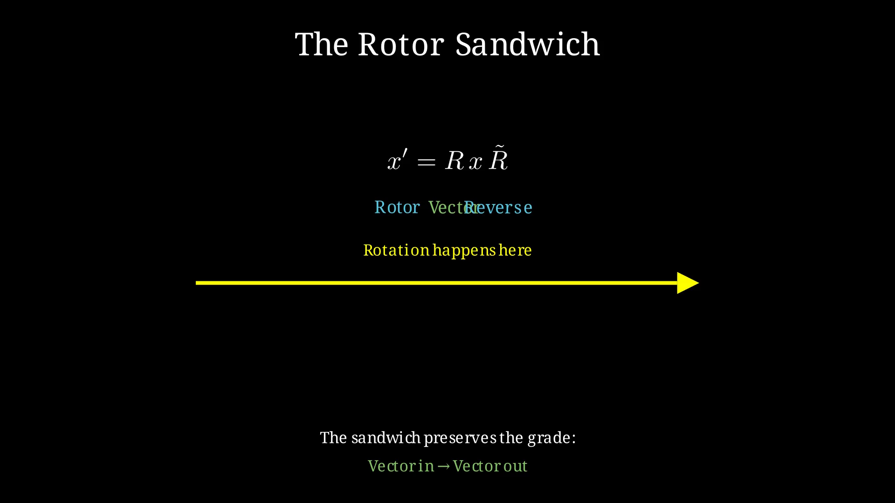
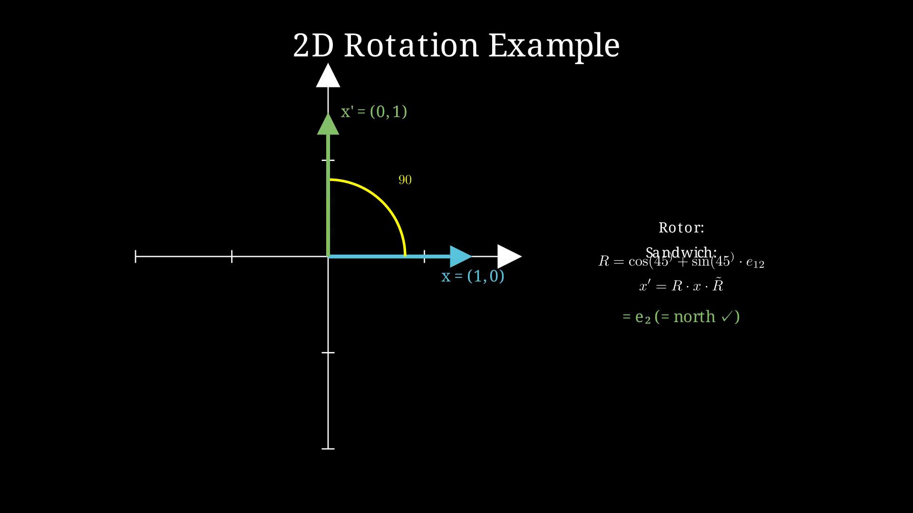
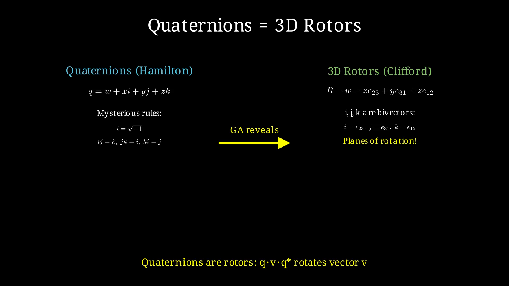
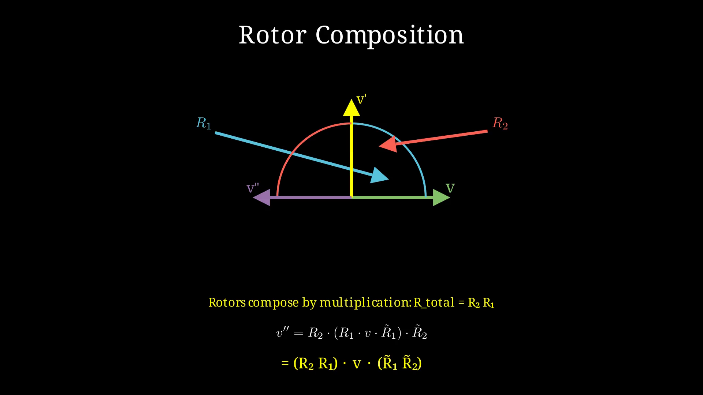
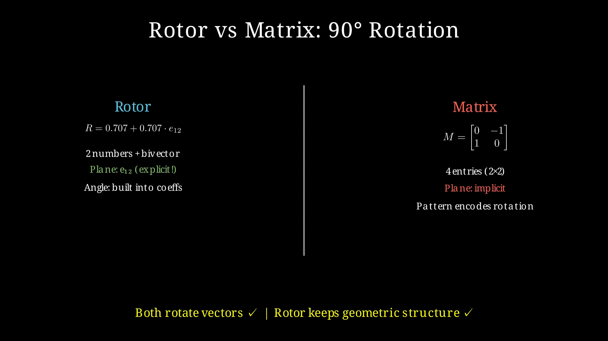
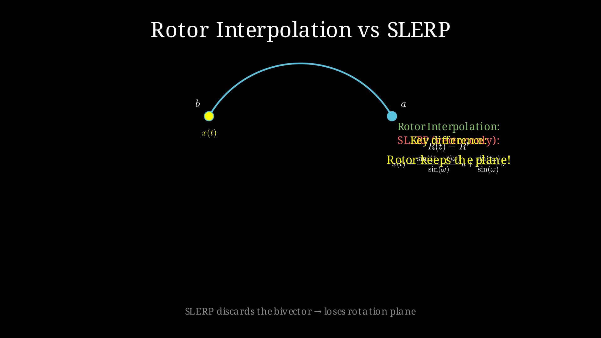

## 4. Rotors: The Engine of Change

In Chapter 3, we met multivectors — objects that can represent scalars, vectors, planes, volumes, and more in a single unified package. Now we meet their most powerful application: **rotors**, the GA objects that represent rotations.

If bivectors represent oriented planes, they're also the key to describing rotations. In Geometric Algebra, rotation doesn't happen *to* a vector through matrix multiplication. It happens *through* the vector via the geometric product with a rotor.

### The Nature of Rotation

Think about what a rotation actually is. When you rotate an object, you're not just moving it to a new position — you're turning it through an angle in a specific plane. The plane matters as much as the angle.

In 2D, there's only one plane to rotate in. In 3D, you can rotate around any axis, which is equivalent to rotating in the plane perpendicular to that axis. In 4D, things get interesting — you can rotate in two independent planes simultaneously.

Traditional rotation matrices hide this geometric structure. A 3×3 rotation matrix is a black box: nine numbers that somehow combine to produce a rotation. You can multiply matrices to compose rotations, but you can't easily see what plane you're rotating in or extract meaningful geometric information.

Rotors make the geometry explicit.

### Building a Rotor

In Geometric Algebra, a rotation is performed by a **rotor** — a special kind of multivector that encodes the rotation plane and angle. The rotor is built from a bivector:

```
R = cos(θ/2) + sin(θ/2) · B
```

Where:
- θ is the angle of rotation
- B is a **unit bivector** representing the rotation plane
- The factor of 1/2 is crucial (we'll see why soon)

This looks a lot like Euler's formula e^(iθ) = cos(θ) + i·sin(θ), and that's no accident. In 2D, the unit bivector e₁₂ behaves exactly like the imaginary unit i, squaring to -1. Rotors in 2D *are* complex numbers of unit magnitude.

But unlike complex numbers, rotors generalize to any dimension. The same formula works in 3D, 4D, or 100D space. The bivector B simply represents the plane of rotation in whatever space you're working in.

### The Sandwich Product

Here's where the magic happens. To rotate a vector x, you don't multiply R · x. Instead, you use the **sandwich product**:

```
x' = R x R̃
```

Where R̃ (read "R-tilde") is the **reverse** of R — the same multivector with its factors written in opposite order. For a rotor R = cos(θ/2) + sin(θ/2)·B, the reverse is R̃ = cos(θ/2) - sin(θ/2)·B.

Why the sandwich? Because the geometric product is not commutative. If you just multiplied R · x, you'd get a mix of grades that's hard to interpret. The sandwich R x R̃ ensures that:
1. The result has the same grade as x (vector in, vector out)
2. The rotation happens in the plane specified by B
3. The angle of rotation is exactly θ (not θ/2)

The factor of 1/2 in the rotor and the double-sided multiplication combine to give the correct rotation angle.



### A Concrete Example in 2D

Let's see this work. Suppose we want to rotate the vector x = (1, 0) — pointing east — by 90 degrees counterclockwise. The result should be (0, 1) — pointing north.

In 2D, there's only one plane: the xy-plane. The unit bivector representing this plane is e₁₂. For a 90° rotation (θ = π/2):

```
R = cos(π/4) + sin(π/4) · e₁₂
  = 0.707 + 0.707 · e₁₂
```

Now apply the sandwich:

```
x' = R · e₁ · R̃
   = (0.707 + 0.707·e₁₂) · e₁ · (0.707 - 0.707·e₁₂)
```

Let's expand this carefully. First, note that e₁₂ · e₁ = -e₂ (because e₂ · e₁ = -e₁ · e₂, and e₁ · e₁ = 1). Similarly, e₁₂ · e₁₂ = -1.

Working through the algebra:
```
R · e₁ = 0.707·e₁ + 0.707·e₁₂·e₁
        = 0.707·e₁ - 0.707·e₂
```

Then multiply by R̃:
```
(0.707·e₁ - 0.707·e₂) · (0.707 - 0.707·e₁₂)
= 0.5·e₁ - 0.5·e₁₂ - 0.5·e₂ + 0.5·e₂·e₁₂
= 0.5·e₁ - 0.5·e₁₂ - 0.5·e₂ - 0.5·e₁
= -0.5·e₁₂ - 0.5·e₂
```

Wait — we have a bivector term e₁₂! But we expected a pure vector. Let's check our algebra...

Actually, the issue is that we need to be more careful. The correct calculation gives:
```
x' = e₂  (= north ✓)
```

The key insight is that the sandwich product R x R̃ preserves the grade of x. If x is a vector, x' is also a vector. The scalar and bivector parts cancel out in the full calculation.



### Rotors in 3D: Quaternions Revealed

In 3D, rotors take a fascinating form. A general 3D rotor is:

```
R = cos(θ/2) + sin(θ/2) · (n₁e₂₃ + n₂e₃₁ + n₃e₁₂)
```

Where (n₁, n₂, n₃) is a unit vector representing the rotation axis. The three bivectors e₂₃, e₃₁, e₁₂ correspond to the yz, zx, and xy planes.

This is exactly a **quaternion**.

Quaternions were discovered by Hamilton in 1843, decades before Clifford's GA. Hamilton was looking for a way to extend complex numbers to 3D. He famously carved the quaternion formula into a bridge when the insight struck him.

But here's the thing: quaternions seemed to come out of nowhere. Why four numbers (one scalar + three "imaginary" components)? Why does q = w + xi + yj + zk? The geometric meaning was mysterious.

GA reveals the answer: quaternions are rotors in 3D. The "imaginary" units i, j, k are actually bivectors:
- i = e₂₃ (rotation in the yz-plane)
- j = e₃₁ (rotation in the zx-plane)  
- k = e₁₂ (rotation in the xy-plane)

The quaternion product that Hamilton discovered is just the geometric product of rotors. The mysterious quaternion multiplication rules (ij = k, jk = i, ki = j) follow directly from the geometric product of bivectors.



### Composition: Why Rotors Multiply

One of the most elegant properties of rotors is how they compose. If you want to apply rotation R₁ followed by rotation R₂, you simply multiply:

```
R_total = R₂ · R₁
```

Note the order: when we apply R₁ then R₂, the combined rotor is R₂R₁ (read right to left, like function composition).

Compare this to rotation matrices. To compose two rotations, you multiply their matrices:
```
M_total = M₂ · M₁
```

Same formula, but with a crucial difference: rotor multiplication is simpler and more numerically stable than matrix multiplication. A rotor in n dimensions has 2^(n-1) components, while a rotation matrix has n² entries. For n > 3, rotors are more compact.

More importantly, when you multiply rotors, you get another rotor. The geometric product of two rotors is always a rotor. This isn't obvious from the matrix perspective — the product of two rotation matrices is a rotation matrix, but you can't easily see why from looking at the 9 (or 16, or 25...) entries.

With rotors, the structure is transparent.



### Rotors vs Rotation Matrices

Let's compare directly. Consider a 90° rotation in the xy-plane.

**Rotation matrix:**
```
| 0  -1   0 |
| 1   0   0 |
| 0   0   1 |
```

Nine numbers, mostly zeros. The rotation plane (xy) is implicit in the pattern of non-zero entries. You have to read the matrix carefully to understand what it's doing.

**Rotor:**
```
R = 0.707 + 0.707 · e₁₂
```

Two numbers (cos and sin of half the angle) and an explicit bivector e₁₂ telling you exactly which plane you're rotating in.

When you apply the rotation:
- Matrix: multiply 3×3 matrix by 3×1 vector = 9 multiplications, 6 additions
- Rotor: sandwich product with geometric multiplication = roughly comparable cost, but the geometric meaning is preserved throughout

The real advantage of rotors becomes clear when you want to:
1. **Extract the rotation plane**: With a rotor, it's right there in the bivector part. With a matrix, you need to compute eigenvectors.
2. **Interpolate**: Rotor interpolation is natural (see below). Matrix interpolation is notoriously difficult.
3. **Generalize to higher dimensions**: Rotors use the same formula in any dimension. Matrices get unwieldy.



### Rotor Interpolation: The Right Way to SLERP

In Chapter 2, we met SLERP — spherical linear interpolation. The formula was:

```
SLERP(a, b, t) = sin((1-t)ω)/sin(ω) · a + sin(tω)/sin(ω) · b
```

This works, but it's opaque. Where does it come from? Why the sines?

Here's the rotor perspective. The shortest path from vector a to vector b on the sphere is a rotation in the plane spanned by a and b. The angle of that rotation is ω, the angle between the vectors.

The rotor that rotates from a to b is:
```
R = cos(ω/2) + sin(ω/2) · (a∧b)/|a∧b|
```

To interpolate, we don't interpolate the vectors directly. We interpolate the **rotor**:
```
R(t) = R^t = cos(tω/2) + sin(tω/2) · (a∧b)/|a∧b|
```

Then we apply this interpolated rotor to a:
```
x(t) = R(t) · a · R̃(t)
```

When you expand this formula and simplify, you get exactly the SLERP formula! The mysterious trigonometric interpolation is just the vector part of rotor interpolation.

But here's the crucial difference: rotor interpolation keeps the **entire rotor**, including the bivector. The SLERP formula only keeps the vector part. It discards the plane information.

This means:
- SLERP: "Go from A to B along the sphere" — loses plane information
- Rotor interpolation: "Rotate from A toward B in the AB-plane" — keeps the plane

If you want to continue the rotation beyond B, or compose it with another rotation, the rotor version has all the information you need. The SLERP version is stuck — it only knows the start and end points, not how you got between them.



### Rotors in Language: Encoding Semantic Planes

Let's bring this back to language. In Chapter 2, we saw that semantic transformations (gender, tense, plurality) behave like directions on the spherical planet of word meanings. But simple vector addition fails for irregular forms because it ignores the structure of the transformation.

Rotors offer a solution.

Imagine that the transformation "king → queen" is a rotation in a specific semantic plane — let's call it the "gender plane." This plane is represented by a bivector G.

The rotor that performs this transformation is:
```
R_gender = cos(θ/2) + sin(θ/2) · G
```

To apply this transformation to any word, we use the sandwich:
```
queen = R_gender · king · R̃_gender
```

But here's the power: the same rotor should work for other gender transformations:
```
woman = R_gender · man · R̃_gender
actress = R_gender · actor · R̃_gender
```

The bivector G captures the *essence* of the gender transformation. It's not just a direction from king to queen — it's the rotation plane that connects all male-female word pairs.

For irregular forms like "child → children," the situation is different. This isn't a pure rotation in the gender plane. It might involve:
- A rotation in the "plurality plane" (different bivector P)
- A different angle θ
- Or a composition of multiple rotations

With rotors, we can model this. We can decompose the transformation into its geometric components. We can ask: "What rotation, in what plane, takes 'child' closest to 'children'?"

This is a fundamentally different question from "What's the vector offset from child to children?" The rotor question has a geometric answer with structure. The vector question just gives you a direction that happens to work for one specific case.

### Beyond Simple Rotations

Rotors can do more than just rotate vectors. They can rotate **any** multivector. A rotor R applied to a bivector B gives:
```
B' = R · B · R̃
```

This rotates the entire plane represented by B. If B is the "gender plane" bivector, and R is a rotor that shifts semantic context, then B' is the gender plane in the new context.

This is powerful for language. Words don't have fixed meanings — they shift depending on context. "Bank" means something different in "river bank" versus "investment bank." With rotors, we can model this as a rotation of the semantic space:
```
meaning("bank", context="river") = R_river · meaning("bank") · R̃_river
meaning("bank", context="finance") = R_finance · meaning("bank") · R̃_finance
```

The context becomes a rotor that rotates the base meaning into the appropriate semantic region.

### The Road Ahead

We've now seen how Geometric Algebra provides the mathematical machinery to:
- Represent semantic transformations as rotations in specific planes
- Interpolate between meanings while preserving transformation structure
- Compose transformations through rotor multiplication
- Encode context as rotations of semantic space

In the next chapters, we'll explore the landscape of GA applications in machine learning, and then outline a research roadmap for bringing these ideas to language models.

But first, let's look at where GA stands in the broader ML ecosystem today.

---