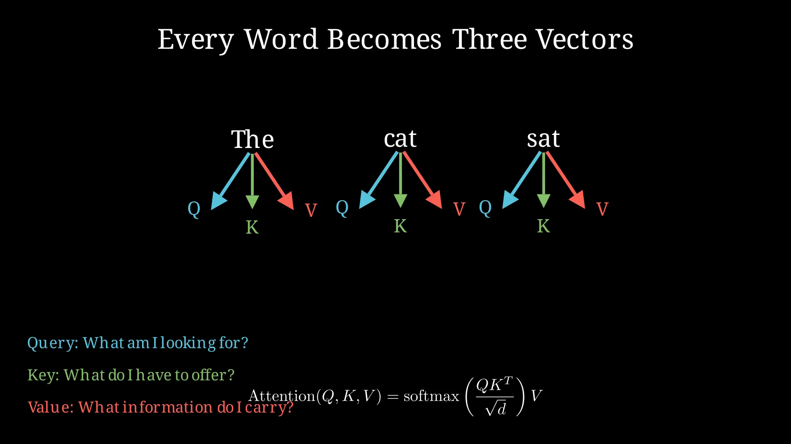
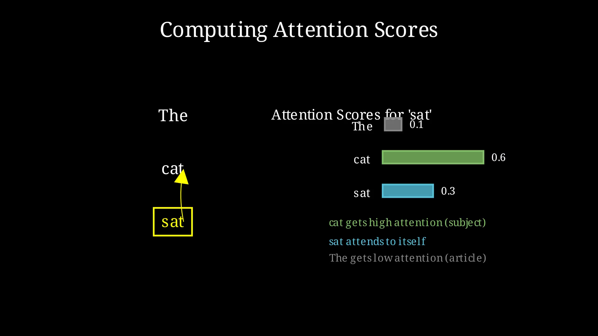
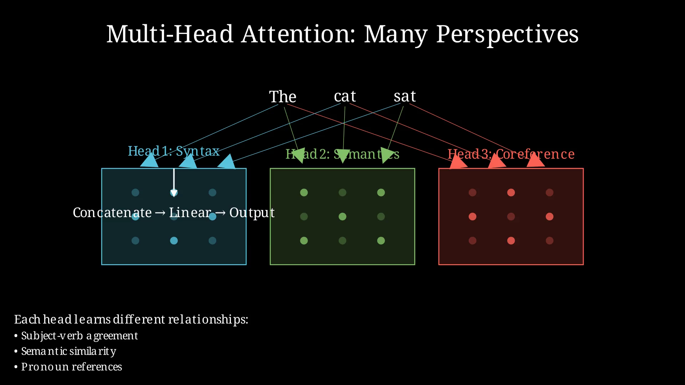
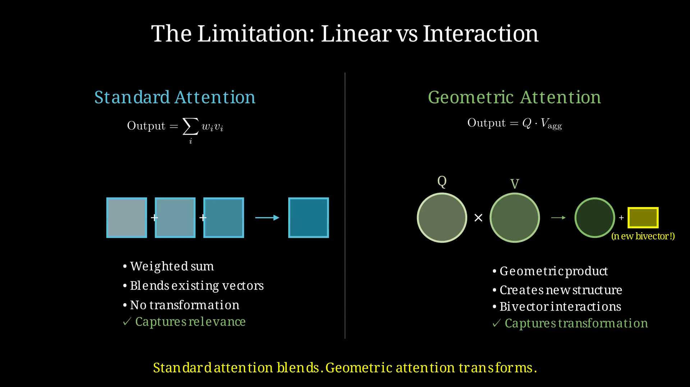

## 5. The Attention Mechanism: How Models Focus

### From Rotors to Relationships

In Chapter 4, we learned that rotors represent transformations — rotations in specific planes. But language isn't just about transforming individual words. It's about relationships *between* words.

Consider: "The cat sat on the mat because it was comfortable."

What does "it" refer to? The cat? The mat? To understand this, you need to look at relationships between words. "It" connects to something earlier in the sentence, and the word "comfortable" provides the clue.

This is what attention does: it lets the model focus on relevant parts of the input when processing each word. It's not about transforming a single vector anymore. It's about computing relationships across dozens, hundreds, or thousands of positions.

### The Core Idea

Attention asks three questions about every pair of words:

1. **Query**: What am I looking for?
2. **Key**: What do I have to offer?
3. **Value**: What information do I carry?

For each word, the model computes a query vector. It compares this query against the key vectors of all other words. The comparison produces attention scores — how much should I focus on each other word? Finally, it takes a weighted sum of value vectors based on those scores.

Mathematically:

```
Attention(Q, K, V) = softmax(Q · Kᵀ / √d) · V
```



The dot product Q · Kᵀ measures alignment. If query and key point in similar directions, they have a strong connection. The softmax turns these into probabilities (they sum to 1). The final output is a blend of values, weighted by relevance.

### An Example Walkthrough

Let's trace through "The cat sat":

| Position | Word | Processing "sat" looks at... |
|----------|------|------------------------------|
| 1 | The | Low attention (article) |
| 2 | cat | High attention (subject) |
| 3 | sat | Self (always attends to itself) |

When processing "sat", the query vector for "sat" has strong dot products with keys for "cat" (the subject doing the sitting) and "sat" itself. The output becomes a blend: mostly "sat", partially "cat", barely "the".



This happens in parallel for every word. Each position gathers information from every other position simultaneously. This is why transformers can be trained efficiently — no sequential processing like RNNs.

### Multi-Head Attention: Many Perspectives

One attention computation might capture grammatical relationships. Another might capture semantic similarity. A third might track coreference (what "it" refers to).

Multi-head attention runs multiple attention operations in parallel:

```
head_1 = Attention(Q₁, K₁, V₁)
head_2 = Attention(Q₂, K₂, V₂)
...
head_h = Attention(Q_h, K_h, V_h)

output = Concat(head_1, ..., head_h) · Wᵒ
```

Each head learns different kinds of relationships. Some heads specialize in syntax (subject-verb agreement). Others track long-range dependencies. Some attend to specific tokens like [SEP] or punctuation.



### The Limitation

Here's the crucial observation: attention is fundamentally a **linear** operation.

The output is a weighted sum of value vectors. It can blend, it can emphasize, but it cannot *transform*. If "king" and "queen" are represented as vectors, attention can notice they're related (high dot product between their keys and queries), but it cannot *apply the gender transformation*.

This is where Geometric Algebra enters. The dot product in standard attention captures alignment. But the geometric product captures **interaction** — it produces new structure (bivectors) that didn't exist in either input.



### A Glimpse Ahead

Imagine if queries, keys, and values weren't vectors but **multivectors**. The attention score would come from the geometric product, not just the dot product. Two words could have high attention not because their vectors align, but because their bivectors align — they share a rotational relationship.

The output wouldn't be a weighted sum. It would be a geometric product between query and aggregated value — creating new bivector structure that encodes how the words interact, not just how they align.

This is **Clifford Frame Attention**, and we'll explore it in Chapter 8. But first, we need to understand what others have built.

### Why This Matters

The attention mechanism is the engine of modern language models. Understanding it deeply — both its power and its limitations — is essential before we can improve it.

Standard attention asks: "Which words are relevant?"

Geometric attention asks: "How do these words *interact*?"

The difference is subtle but profound. Relevance is a scalar (a single number). Interaction produces structure (bivectors, multivectors). One blends existing information. The other creates new geometric relationships.

The journey from vectors to rotors (Chapter 4) prepared us to think about transformations. Now we're ready to think about relationships. And when we combine them — transformations plus relationships, rotors plus attention — we get something genuinely new.

---

