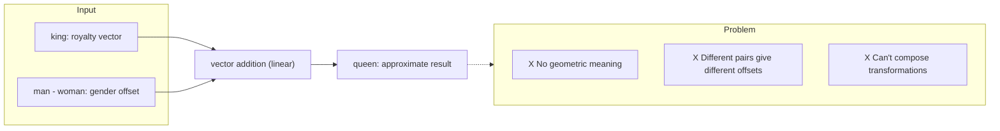
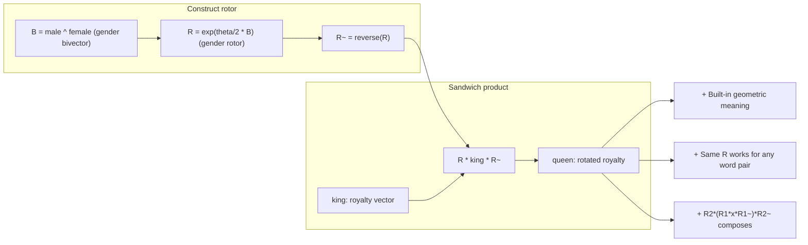
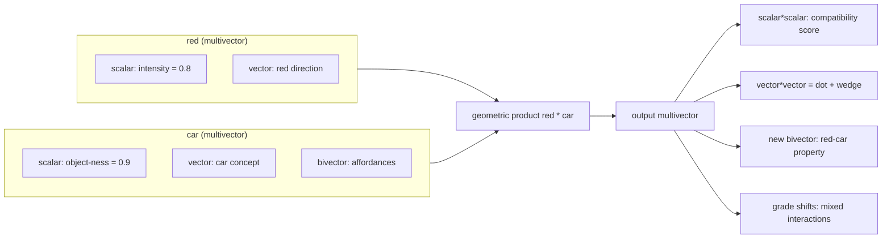

## 7. Beyond Rotors: The Multivector Hypothesis

If you're intrigued by the idea of bivectors (oriented planes), you might wonder: what else hides inside the multivector structure?

A multivector in Cl(3,0,0) — Geometric Algebra of 3D space — has eight components:

- 1 scalar (grade 0): a pure number
- 3 vectors (grade 1): directions
- 3 bivectors (grade 2): oriented planes
- 1 trivector (grade 3): oriented volume

Now imagine that instead of representing each word as a single vector in 512-dimensional space, you represent it as a *multivector* in a smaller Cl(8,0,0) space. Each word is now a package with distinct geometric grades that can carry different kinds of linguistic information:

| Grade | Geometric meaning | Possible linguistic role |
|-------|-------------------|--------------------------|
| 0 (scalar) | A magnitude | Abstract category: noun-ness, verb-ness, register, formality |
| 1 (vector) | A direction | Core semantic content: "royalty", "animal", "action" |
| 2 (bivector) | An oriented plane | Relationships between concepts: gender transition, tense shift, polarity flip |
| 3+ (higher) | Multi-way interactions | Compositional structure: how multiple words combine |

This is the **multivector embedding hypothesis**: different aspects of linguistic meaning naturally map to different grades of a multivector. The geometric product between words becomes a rich interaction, not just a simple comparison.

### Worked Example: King → Queen

Let's make this concrete. Suppose we represent "king" as a multivector where:

- **Scalar part** = +0.9 (high noun-ness, high concreteness)
- **Vector part** = a unit vector in the direction of "royalty" (learned from data)
- **Bivector part** = zero initially (no built-in transformation)

Now consider the transformation from "king" to "queen". In standard word embeddings, this is captured as a vector offset:

```
king + (-man + woman) ≈ queen
```



In the multivector framework, this becomes a **geometric transformation**:

```
R * king * R~ = queen
```



Where R is a rotor encoding a gender transition -- a rotation in the plane spanned by "male" and "female" directions. The bivector B = "male" ^ "female" defines the rotation plane, and the rotor R = exp(theta/2 * B) applies the transition.

The crucial difference from the vector offset approach:

- **Vector offset**: `king + (-man + woman)` works statistically but has no geometric interpretation. Why does adding "maleness subtracted, femaleness added" produce "queen"? The model doesn't know — it just learned the correlation.
- **Rotor transformation**: `R · king · R̃` says "rotate the concept of royalty in the gender plane." The geometry *means* something. The bivector explicitly encodes that gender transition is a rotation between two poles, not a linear shift.

Furthermore, the rotor representation composes cleanly:

```
R₂ · (R₁ · king · R̃₁) · R̃₂
```

A second rotor could add tense ("king" → "queen" → "former queen"), or register ("queen" → "Your Majesty"). Each transformation is a separate geometric operation, not an embedding lookup.

### Compositionality via Geometric Product

One of the deepest problems in language understanding is **compositionality**: how do words combine to form phrase meanings?

Standard neural networks handle this through attention — a weighted sum of value vectors. This works, but it's fundamentally a *linear* operation. The geometric product offers a *bilinear* alternative that captures interactions standard attention cannot.

Consider "red car". In a multivector embedding space:



- **red**: vector part encodes the color direction; scalar part encodes intensity
- **car**: vector part encodes the object concept; bivector part encodes affordances (drives, contains people, etc.)

The geometric product "red" · "car" produces a multivector with cross-grade terms:

```
red · car = (scalar·scalar) + (scalar·vector + vector·scalar) + (vector·vector + scalar·bivector + ...) + ...
```

The key term is **vector·vector** = dot product + wedge product. The dot captures compatibility ("is 'red' a property that applies to 'car'?") while the wedge captures the *new meaning created by their combination* ("red car" isn't just the sum of its parts — it implies a specific object with a specific property).

Standard vector composition (addition or element-wise multiplication) cannot produce this emergent structure. The geometric product naturally does.

### Negation as Bivector Reflection

Negation is surprisingly hard for standard word vectors. If "happy" has a positive vector, what does "not happy" look like? In practice, negation doesn't map to negation of the vector (that would give you -"happy", which is meaningless). And "unhappy" isn't the opposite of "happy" in vector space — it's a different concept entirely.

In the multivector framework, negation can be modeled as a **reflection through a semantic plane**. Consider a bivector P representing the polarity axis (positive ↔ negative). To negate a concept:

```
unhappy = R_π · happy · R̃_π
```

Where R_π is a rotor that rotates by π in the polarity plane P. This rotates the semantic vector to its polar opposite while preserving the concept's other properties (intensity, register, etc.).

This is more than a neat analogy. If the model learns a *single* polarity rotor that works across many words, it means the geometry of negation is *shared* — exactly the kind of structural generalization that standard embeddings struggle with.

### Analogy as Rotor Algebra

The classic word analogy "king : queen :: man : woman" has a simple rotor interpretation:

```
R_gender · king · R̃_gender ≈ queen
R_gender · man · R̃_gender ≈ woman
```

The *same rotor* R_gender transforms both pairs. This means the geometric algebra naturally captures the one-to-many mapping that vector offsets approximate:

- `queen - king =?= woman - man` in vector space
- `R_gender` applied to both in GA space

The rotor formulation is *exact* (the same transformation applies to all words in the same semantic domain). The vector offset formulation is *approximate* (different word pairs give slightly different offset vectors).

This also means the rotor components of a multivector vocabulary explicitly encode the *transformational structure* of the semantic space — which dimensions are axes of variation, which are invariant, and how concepts relate to each other through shared transformations.

### What This Means

None of this is proven at scale. But there are now three independent lines of evidence pointing in the same direction:

1. The FGA paper showing transformer operations can be expressed as GA operations
2. The gattrlm experiments showing Clifford layers improve geometric reasoning
3. Our gaflowlm results showing rotor-based training signals break performance ceilings

The multivector hypothesis makes a testable prediction: a language model trained with multivector embeddings and geometric product attention should learn compositional structure more efficiently than an equivalent vector-based model, especially on tasks requiring systematic generalization (analogy, negation, composition).

That test hasn't been run yet. But the machinery to run it is now in place.

### Clifford Frame Attention: The Mechanism

The ideas above are compelling in theory, but they need a concrete neural network mechanism to work. That mechanism already exists: **Clifford Frame Attention (CFA)**.

Standard attention computes:

```
Attention(Q, K, V) = softmax(Q · Kᵀ / √d) · V
```

The dot product Q·Kᵀ produces a single scalar per query-key pair. It asks: "how similar are these two vectors?" — but it discards everything except the alignment.

CFA replaces every step with geometric operations:

**1. Multivector projections.** Instead of projecting input vectors to Q, K, V, CFA projects *multivectors* to Q, K, V. Each is a full multivector in Cl(k,0,0) — carrying scalar, vector, bivector, and higher-grade information.

**2. Grade-weighted scoring.** The attention score is computed as the geometric product's scalar part between query and key:

```
score = ⟨Q · reverse(K)⟩₀
```

The `reverse(K)` operation flips the signs of higher-grade blades, making the product respect the geometric structure. The scalar part is the *grade-0 component* of the geometric product — which includes both the standard dot product AND contributions from higher-grade interactions.

This means two tokens can have a high attention score not just because their vectors align, but because their bivectors align — they share a rotational relationship, even if their vector directions are orthogonal.

**3. Bilinear output.** After aggregating values via the attention weights, CFA applies one more geometric product:

```
output = geometric_product(Q, V_agg) + V_agg
```

This is the key innovation. Where standard attention outputs a weighted sum of values (a linear operation), CFA outputs a **geometric product** between the query and the aggregated value (a bilinear operation). This captures interactions that no linear combination can:

- If Q and V_agg both have strong vector components, their geometric product produces a bivector — encoding the *plane of interaction* between the two pieces of information.
- If one has a strong bivector and the other a strong vector, the product shifts grade, creating a vector that mixes both.

In code, the core of CFA is remarkably compact:

```python
# Grade-weighted score (Q, K are multivectors)
score = torch.matmul(Q, K * grade_signs) · scale
weights = softmax(score)
V_agg = weights · V

# Bilinear output via geometric product
output = engine.geometric_product(Q, V_agg) + V_agg
```

The current implementation lives in `gaflowlm/models/cfs_arch.py`, as part of the CFS flow-matching model. It hasn't yet been extracted into the attractor backbone (gattrlm) or the flow backbone (gaflowlm RHF). That integration — pairing CFA with a proper CE training loop — is one of the most concrete next steps on the research roadmap.

---

