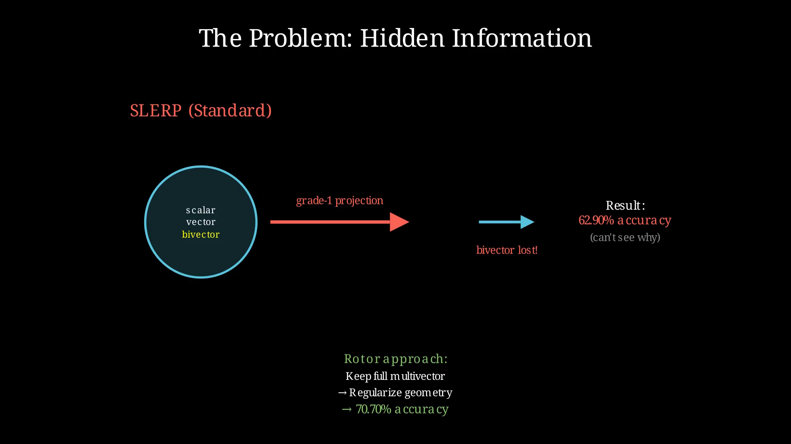
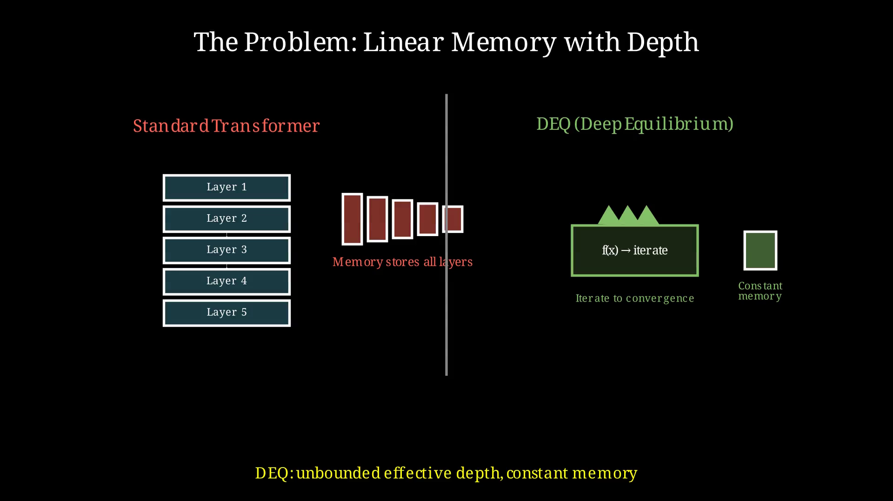
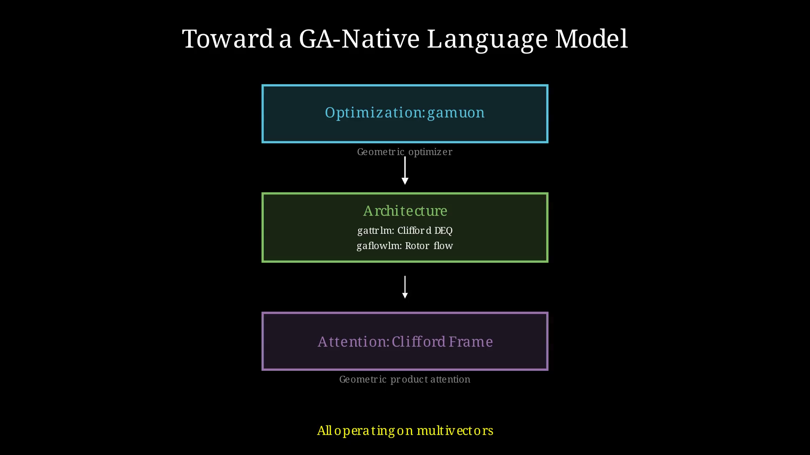

## 7. Three Projects: Building With GA

Chapter 6 showed how others have applied Geometric Algebra to 3D reasoning, protein generation, and semantic theory. This chapter turns inward: three projects from our own research, each attacking a different layer of the language modeling stack.

The pattern is the same: identify a limitation in standard approaches, find where GA provides leverage, and build something to test the hypothesis.

---

### The Problem of Hidden Information

**The Problem:**

Flow matching has emerged as a powerful approach for continuous generative modeling. It works by interpolating on a hypersphere between noise and data using SLERP. The mathematics are elegant, the training is stable, and the results are competitive with diffusion.

But the standard approach discards information. SLERP operates on the surface of the sphere, treating each point as a vector. The rotation that moves you from noise to data has structure — a plane of rotation, encoded in the bivector. SLERP projects this to grade 1 and throws the bivector away.

**The GA Opportunity:**

What if we kept the bivector? Rotors encode both the angle and the plane of rotation. The full rotor sandwich R · x · R̃ contains more information than its grade-1 projection.

The key insight: SLERP(x₀, x₁, t) = ⟨R(t) · x₀ · R̃(t)⟩₁. They're mathematically equivalent at the output, but the rotor version carries the full multivector through the computation.

This means:
- We can train with the same objective (the grade-1 projection matches SLERP)
- But we have access to the bivector components during training
- These components might reveal structure invisible to standard methods

**What We Built:**

**gaflowlm** replaces SLERP with rotor-based flow matching. The architecture is identical — same transformer backbone, same training loop — except the interpolation uses rotors.

**Current Status:**

The RHF rotor primitives are **numerically identical** to the standard trigonometric SLERP implementation. They pass the same forward pass, produce the same checkpoints, and match bit-for-bit on validation metrics. This is a rewrite, not a speedup or a quality improvement.

The structural benefit — having access to the full bivector during training — is real but **unproven at scale**. The CFS (Clifford Flow Matching) track is the active research direction, using multivector embeddings and Clifford Frame Attention. It reaches clean flow-loss convergence on wikitext-2 but has not yet matched standard AR language modeling quality.

| Setup | AR gen_ppl | SFM ≡ RHF gen_ppl |
|-------|-----------|-------------------|
| wikitext-2, 2k steps | **955** | 6655 |
| wikitext-2, 10k steps | **172** | 8124 |

The flow objective is not directly comparable to standard perplexity. The real test — whether the bivector information enables a breakthrough on real language tasks — is still open.



---

### The Problem of Linear Memory Growth

**The Problem:**

Standard transformers stack layers: layer 1 feeds layer 2 feeds layer 3... feed layer L. Each layer transforms the representation, and you need to store intermediate activations for backpropagation. Memory grows with depth.

This is expensive. For a 96-layer model, you're storing 96 sets of activations. The computation is parallel across the sequence, but sequential through the layers. Want deeper reasoning? Pay linear memory cost.



Deep Equilibrium (DEQ) models offer an alternative: instead of stacking L different layers, iterate a single layer f until convergence.

```
x_{t+1} = f(x_t) for t = 0, 1, 2, ...
```

The representation converges to a fixed point — an attractor. You can iterate for hundreds of steps while storing only the final state (using implicit differentiation for gradients). Memory becomes constant in depth.

**The GA Opportunity:**

What if the DEQ iteration operated on multivectors instead of vectors? Each state would be a complete geometric object with scalar, vector, bivector, and trivector components. The fixed point would be a geometric equilibrium, not just a numerical one.

**What We Built:**

**gattrlm** adds Clifford algebra layers to the DEQ framework. Instead of iterating vector transformations, we iterate geometric transformations.

**Current Status:**

The Clifford variants are **quality-neutral or slightly worse on plain text** compared to the standard Attractor baseline. On wikitext-103, the best Clifford variant (AttnOnlyCliffordLM) reaches 6.0156 val loss vs 6.0376 for the baseline — a difference well within noise. The Clifford MLP adds 4× wall-clock for zero quality gain.

Where GA pays off is **geometric tasks**. On a synthetic rotor regression task (predict R · v · R̃ from v and R), the Clifford attention variant achieves 4×–48× better extrapolation than standard attention:

| Arm | Angle gap | Axis gap |
|-----|-----------|----------|
| MLP (no Clifford) | 109× | 215× |
| CliffordAttn | **4.2×** | **2.5×** |

The lesson: Clifford attention is the operative component for equivariance, but it does not improve language modeling at the 140M scale. The geometric structure is free when you need it, but it costs a small penalty on text where no geometric structure is present.

---

### The Problem of Geometric Optimization

**The Problem:**

Training neural networks is optimization: find weights that minimize loss. The optimizer's job is to propose weight updates based on gradients.

Standard optimizers (Adam, SGD) treat weights as raw numbers. They don't know that a weight matrix might represent a rotation, or that certain directions in parameter space are more "natural" than others.

The Muon optimizer takes a step toward geometric awareness. It computes the matrix sign function of the gradient — the nearest orthogonal matrix — and uses that as the update direction. This respects the structure of linear transformations better than raw gradient descent.

**The GA Opportunity:**

Orthogonal matrices are rotors in even dimensions. The matrix sign function is a geometric operation hiding in linear algebra notation.

In GA terms:
- Gradients are multivectors in the Clifford algebra of the weight space
- The sign function becomes a geometric function on multivectors
- Orthogonality is natural under the geometric product
- The same operation works for scalars, vectors, matrices, and higher-order structures

**What We Built:**

**gamuon** reformulates Muon using Geometric Algebra. The core computation — finding the geometrically natural update direction — becomes a multivector operation.

**Current Status:**

The theoretical foundation exists and is implemented. The grade decomposition (scalar, bivector, strain) is correct. The rotor exponential uses closed-form formulas for 2×2 and 3×3, and `torch.matrix_exp` for larger matrices. The versor sandwich update is implemented.

But the **training benchmarks are negative**. On a standard transformer trained on wikitext-2:

| Optimizer | Final val loss | Time per step |
|-----------|---------------|---------------|
| Adam | **6.21** | 4.9 ms |
| Muon (NS) | 6.52 | 11.0 ms |
| Gamuon | 6.25 | **30.7 ms** |

Gamuon is **6× slower than Adam** with slightly worse validation loss. The bottleneck is `torch.matrix_exp` on the rotor exponential — an iterative Padé approximation that dominates the step cost.

On the bbt 16L dim16 byte-level diffusion model (TinyStories, 1000 steps):

| | AdamW | GamuonAuto |
|---|---|---|
| step 900 loss | **3.18** | **3.83** |
| time/step | **~16 s** | **~26 s** |

Gamuon reaches **~20% worse loss** at 40% slower speed. The rotor exponential cost on many small 2D matrices (q_proj, k_proj, v_proj, o_proj, MLP layers) compounds. Additionally, GamuonAuto routes non-2D parameters (embeddings, norms, biases) to SGD, which is suboptimal for language modeling; switching to AdamW for those params did not change the outcome because the matrix_exp bottleneck dominates.

**The honest assessment:** The mathematics is elegant, but the rotor exponential is too expensive for standard LM training. The grade-aware updates do not compensate for the compute cost. Unless a faster rotor approximation is found, Gamuon is not competitive with AdamW for language models.

---

### Toward Integration

The three projects attack different problems:

| Project | Layer | What it does | Status |
|---------|-------|--------------|--------|
| gaflowlm | Generation | Rotor-based flow matching, preserves bivector | Numerically validated; no LM win yet |
| gattrlm | Architecture | DEQ + Clifford layers, constant memory | Equivariance proven; text quality neutral |
| gamuon | Optimization | Grade-aware multivector optimizer | **Negative result: slower than AdamW with worse convergence** |



They're not yet building blocks for a unified stack. They are independent experiments testing whether GA provides advantage at each layer. The honest answer so far:

- **gaflowlm**: The rotor primitives work. The CFS track is promising but not yet competitive.
- **gattrlm**: Clifford attention gives free equivariance but does not improve text quality.
- **gamuon**: The mathematics is elegant, but the rotor exponential is too expensive for standard LM training.

The missing piece — Clifford Frame Attention — connects the geometry of individual tokens to the relationships between them. That's Chapter 8.

---
