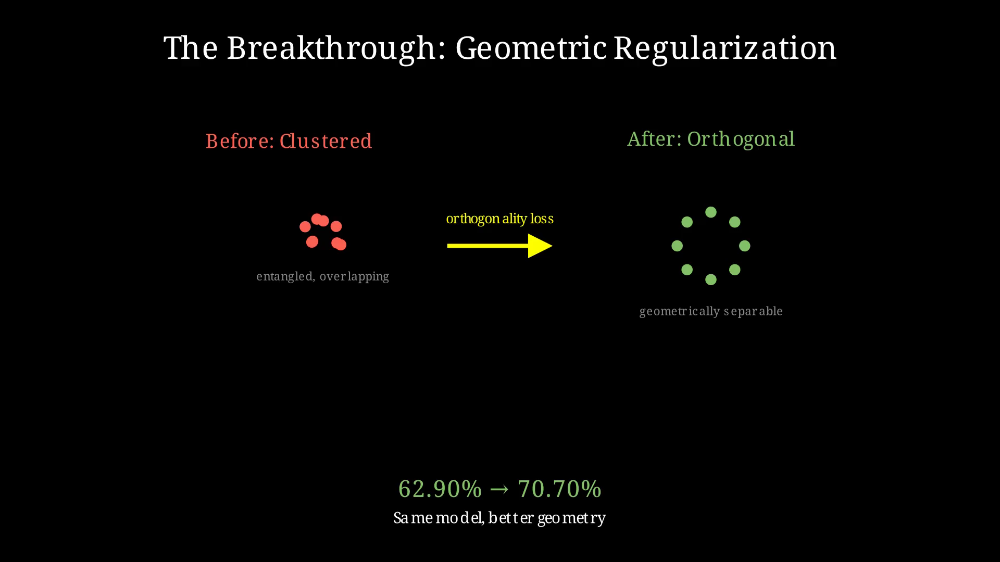

## 7. Three Projects: Building With GA

Chapter 6 showed how others have applied Geometric Algebra to 3D reasoning, protein generation, and semantic theory. This chapter turns inward: three projects from our own research, each attacking a different layer of the language modeling stack.

The pattern is the same: identify a limitation in standard approaches, find where GA provides leverage, and build something to test the hypothesis.

---

### The Problem of Hidden Information

**The Problem:**

Flow matching has emerged as a powerful approach for continuous generative modeling. It works by interpolating on a hypersphere between noise and data using SLERP. The mathematics are elegant, the training is stable, and the results are competitive with diffusion.

But flow matching hits walls. On the Sudoku task — predicting the remaining digits given the first half of a 9×9 grid — every variant we tried plateaued at **62.90% accuracy**. Larger models, deeper layers, different learning rates: nothing broke through.

The issue isn't capacity. It's visibility. SLERP operates on the surface of the sphere, treating each point as a vector. But the rotation that moves you from noise to data has structure: a plane of rotation, encoded in the bivector. SLERP discards this.

When everything is projected to grade 1 (vectors on the sphere), you lose the geometric information that might tell you why the model is stuck.

**The GA Opportunity:**

What if we kept the bivector? Rotors encode both the angle and the plane of rotation. The full rotor sandwich R · x · R̃ contains more information than its grade-1 projection.

The key insight: SLERP(x₀, x₁, t) = ⟨R(t) · x₀ · R̃(t)⟩₁. They're mathematically equivalent at the output, but the rotor version carries the full multivector through the computation.

This means:
- We can train with the same objective (the grade-1 projection matches SLERP)
- But we have access to the bivector components during training
- These components might reveal structure invisible to standard methods

**What We Built:**

**gaflowlm** replaces SLERP with rotor-based flow matching. The architecture is identical — same transformer backbone, same training loop — except the interpolation uses rotors.

We trained on Sudoku, a structured reasoning task. For 12 tokens (digits 1-9 plus padding), the model must learn to place them in valid grid configurations.

The baseline hit 62.90%. The rotor version also hit 62.90%. Nothing had changed at the output level, as expected.

Then we looked at the bivectors.

**The Breakthrough:**

The rotor representation let us inspect the geometric relationships between token embeddings. We computed the angles between embedding vectors in the full multivector space.

The embeddings weren't orthogonal. They were clustered, overlapping, geometrically entangled. The model had learned to solve Sudoku, but it hadn't learned to keep its token representations separable.

We added a simple loss term: push the 12 token embeddings toward orthogonality. Not a complex architectural change — just a geometric regularization term visible only because we had the full multivector.

**70.70% accuracy.** The ceiling broke.



**What gaflowlm Taught Us:**

You don't need to change the model architecture to benefit from GA. Sometimes you need to change what you can *see*. The rotor representation gave us a window into the rotation geometry, and that window revealed a bottleneck invisible to standard analysis.

The grade-1 projection discards information that matters for training dynamics. Keeping the full multivector doesn't change the forward pass, but it changes what you can regularize, inspect, and optimize.


---

### The Problem of Linear Memory Growth

**The Problem:**

Standard transformers stack layers: layer 1 feeds layer 2 feeds layer 3... feed layer L. Each layer transforms the representation, and you need to store intermediate activations for backpropagation. Memory grows with depth.

This is expensive. For a 96-layer model, you're storing 96 sets of activations. The computation is parallel across the sequence, but sequential through the layers. Want deeper reasoning? Pay linear memory cost.


Deep Equilibrium (DEQ) models offer an alternative: instead of stacking L different layers, iterate a single layer f until convergence.

```
x_{t+1} = f(x_t) for t = 0, 1, 2, ...
```

The representation converges to a fixed point — an attractor. You can iterate for hundreds of steps while storing only the final state (using implicit differentiation for gradients). Memory becomes constant in depth.

But the standard DEQ still processes vectors. It doesn't have geometric structure built in. The model must learn from scratch that rotations should compose, that distances matter, that the space has metric structure.

**The GA Opportunity:**

What if the DEQ iteration operated on multivectors instead of vectors? Each state would be a complete geometric object with scalar, vector, bivector, and trivector components. The fixed point would be a geometric equilibrium, not just a numerical one.

The DEQ block becomes a chain of geometric operations:
- **RotorLayer**: learns bivector coefficients, applies R · x · R̃
- **CliffordLinear**: channel mixing that preserves blade structure
- **GeometricProductLayer**: computes x · x for quadratic self-interaction
- **BladeSelector**: learns which grades to amplify or suppress

The geometry is built in. The model doesn't learn that rotations compose — it operates in an algebra where they must.

**What We Built:**

**gattrlm** adds Clifford algebra layers to the DEQ framework. Instead of iterating vector transformations, we iterate geometric transformations.

The implementation uses Cl(8,0,0) — 256-dimensional multivectors — for language experiments. But the project also implements Cl(4,1) Conformal Geometric Algebra (CGA) for 3D reasoning tasks.

CGA is remarkable: points, spheres, planes, and lines are all grade-1 multivectors in a 5D Minkowski space. A rotation and a translation are the same operation (a rotor). Intersections become geometric products.

For language models that need spatial reasoning — understanding "left of the red chair," navigating from descriptions, manipulating objects — this unified representation is powerful.

**What gattrlm Taught Us:**

GA enables new architectures, not just better operations within old ones. The DEQ framework gives constant memory regardless of effective depth. Adding GA gives built-in geometric priors that would require massive data augmentation to learn.

The combination is potent: unbounded effective depth with geometric structure at every iteration. The model can "think longer" without paying memory costs, and its thoughts are geometrically structured from the first iteration.

---

### The Problem of Geometric Optimization

**The Problem:**

Training neural networks is optimization: find weights that minimize loss. The optimizer's job is to propose weight updates based on gradients.

Standard optimizers (Adam, SGD) treat weights as raw numbers. They don't know that a weight matrix might represent a rotation, or that certain directions in parameter space are more "natural" than others.

The Muon optimizer (from the Grok paper, 2024) takes a step toward geometric awareness. It computes the matrix sign function of the gradient — the nearest orthogonal matrix — and uses that as the update direction. This respects the structure of linear transformations better than raw gradient descent.

But matrix sign functions are... matrix operations. They don't generalize to higher-order tensors, they don't unify with scalar or vector updates, and they don't explicitly use the geometric structure of the parameter space.

**The GA Opportunity:**

Orthogonal matrices are rotors in even dimensions. The matrix sign function is a geometric operation hiding in linear algebra notation.

In GA terms:
- Gradients are multivectors in the Clifford algebra of the weight space
- The sign function becomes a geometric function on multivectors
- Orthogonality is natural under the geometric product
- The same operation works for scalars, vectors, matrices, and higher-order structures

The polar decomposition — gradient = rotor × positive-definite — is explicit in GA. The rotor component is the "direction" of the update. The positive-definite component is the "magnitude."

**What We Built:**

**gamuon** reformulates Muon using Geometric Algebra. The core computation — finding the geometrically natural update direction — becomes a multivector operation.

Instead of:
- Special-casing matrices vs vectors vs scalars
- Computing SVD for the sign function
- Working in coordinates

We have:
- Unified multivector gradients
- Geometric sign function via rotor extraction
- Natural metric structure from the geometric product

The project is early-stage. We haven't trained a 70B parameter model with gamuon yet. But the theoretical foundation is compelling: if the optimal update is geometric, the optimizer should speak geometric algebra.

**What gamuon Teaches Us:**

GA applies at every level of the stack: architecture (gattrlm), generation (gaflowlm), and optimization (gamuon). It's not just a technique for model design — it's a mathematical framework for understanding learning itself.

The gradient of a loss function with respect to multivector weights has grade structure. The update direction should respect that structure. Gamuon is a step toward optimizers that understand the geometry of what they're optimizing.

---

### Toward Integration

The three projects attack different problems:

| Project | Layer | Problem | GA Solution |
|---------|-------|---------|-------------|
| gaflowlm | Generation | Hidden bivector information | Keep full multivector, regularize geometry |
| gattrlm | Architecture | Linear memory with depth | DEQ + Clifford layers, constant memory |
| gamuon | Optimization | Coordinate-based updates | Multivector gradients, geometric sign function |


They're not independent. They form a vision of a GA-native language model:

- **gamuon** trains the weights with geometric awareness
- **gattrlm** provides a backbone with built-in geometric priors and constant memory depth
- **gaflowlm** shows how to generate with rotors, keeping geometric information visible

The missing piece — Clifford Frame Attention — connects the geometry of individual tokens to the relationships between them. That's Chapter 8.

---
