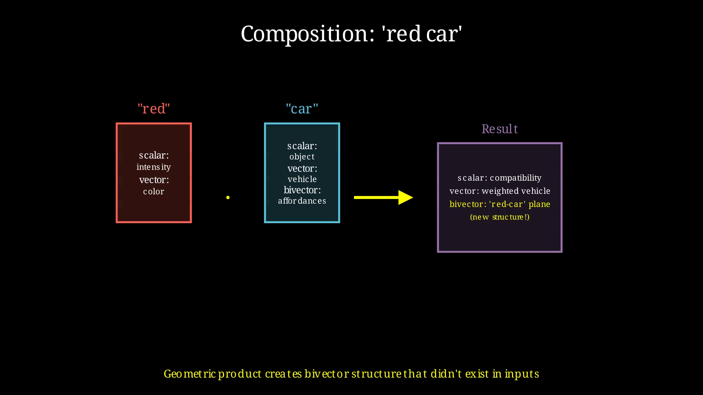
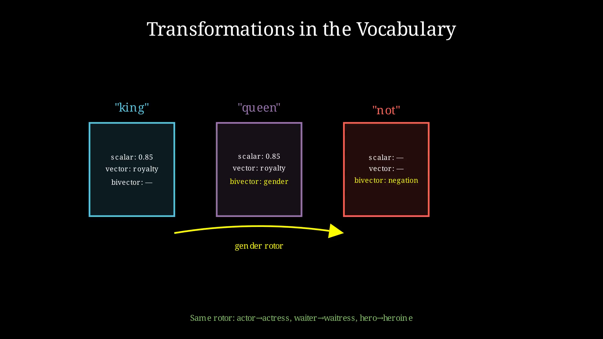
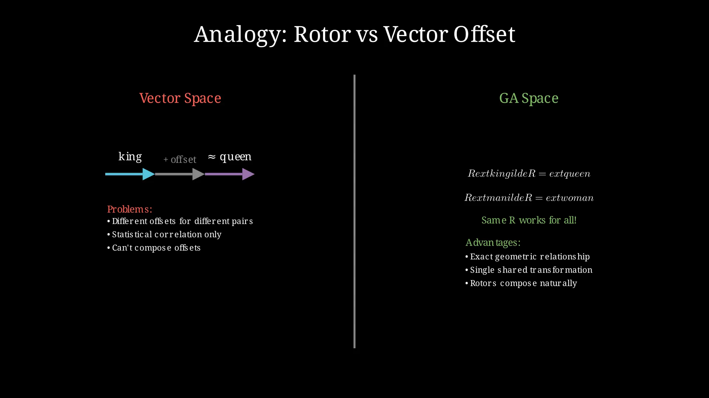
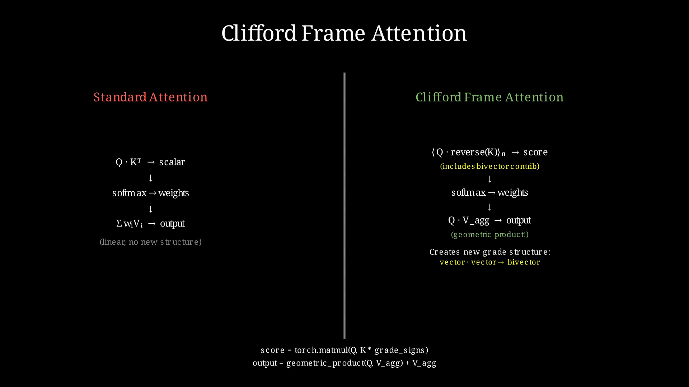

## 8. Beyond Rotors: The Multivector Hypothesis

### The Problem of Composition

Here's a phrase that exposes the limitation of everything we've discussed so far: **"red car.**

Chapter 5 showed that attention produces weighted sums. Chapter 6 showed that others have used geometric algebra for 3D reasoning and protein generation. Chapter 7 showed that keeping multivector structure can improve training.

But we still haven't solved the core problem: **composition**.

In standard embeddings, "red car" is represented as:

```
"red car" ≈ "red" + "car"  (or a weighted sum via attention)
```

This is unsatisfying. A red car isn't just the sum of redness and car-ness. It's a specific kind of car with specific properties — it attracts attention, costs more to insure, gets pulled over more often. The meaning *emerges* from the interaction.

Attention can blend. Rotors can transform. But neither creates *new structure* from the combination of two words.

What if the operation between words could produce geometric structure that didn't exist in either word alone?

### The Multivector Hypothesis

In Geometric Algebra, a multivector in Cl(3,0,0) has eight components:

- **1 scalar** (grade 0): magnitude, intensity
- **3 vectors** (grade 1): directions  
- **3 bivectors** (grade 2): oriented planes
- **1 trivector** (grade 3): oriented volume

The multivector hypothesis: linguistic meaning factorizes across these grades.

| Grade | Geometric role | Linguistic role |
|-------|----------------|-----------------|
| Scalar | Magnitude | Category: noun-ness, verb-ness, intensity |
| Vector | Direction | Core semantics: "royalty," "motion," "color" |
| Bivector | Oriented plane | Relationships: gender, tense, negation |
| Trivector+ | Volume | Composition: how words combine |

Words aren't vectors. They're multivectors with internal structure.

### "Red Car" as Geometric Product

Let's make this concrete:

- **"red"** = scalar(0.8, intensity) + vector(red-direction)
- **"car"** = scalar(0.9, object-ness) + vector(car-concept) + bivector(affordances)

The geometric product "red" · "car" produces cross-grade terms:

```
scalar·scalar   → compatibility (does red apply to car?)
scalar·vector   → weighted concept
vector·vector   → dot + wedge product
```

The **wedge product** creates a new bivector representing the "red-car" relationship — an oriented plane spanned by color and object. This geometric structure didn't exist in either word alone.

Standard composition (addition, attention) cannot produce this. The geometric product does it naturally.



### Transformations in Vocabulary

In Chapter 4, rotors encoded transformations as operations. In a multivector embedding space, transformations become part of the *representation*.

Consider:

| Word | Scalar | Vector | Bivector |
|------|--------|--------|----------|
| king | 0.85 (noun) | royalty | — |
| queen | 0.85 (noun) | royalty | gender-plane |
| not | — | — | negation-plane |



"Queen" carries the gender transformation in its bivector component. "Not" is pure transformation — a bivector waiting to be applied.

The king → queen transformation:

```
queen = R_gender · king · R̃_gender
```

Same rotor works for actor→actress, waiter→waitress, hero→heroine. The transformation is shared, composable, and geometrically explicit.

### Analogy as Rotor Equality

The analogy "king : queen :: man : woman" becomes a geometric fact:

```
R_gender · king · R̃_gender ≈ queen
R_gender · man · R̃_gender ≈ woman
```

Same rotor transforms both pairs. In vector space, analogies are approximate patterns models memorize. In GA space, they're exact geometric relationships.

The rotor components of a multivector vocabulary encode the transformational structure of language explicitly. Instead of thousands of vector offsets, the model learns a geometric operation that applies wherever the dimension exists.



### Negation as Reflection

Negation is notoriously hard for vectors. "Not happy" isn't -"happy" (meaningless). "Unhappy" is a different concept.

In the multivector framework, negation is reflection through a semantic plane:

```
not-happy = R_π · happy · R̃_π
```

A π-rotation in the polarity bivector flips the semantic vector to its opposite while preserving intensity, register, and other properties. Structured transformation, not arbitrary negation.

### Clifford Frame Attention: The Mechanism

The hypothesis needs a concrete mechanism. That mechanism is **Clifford Frame Attention (CFA)**.

Standard attention:

```
score = Q · K^T  (dot product, scalar)
output = Σ weights · V  (weighted sum)
```

CFA replaces both steps with geometric operations:

**1. Grade-weighted scoring:**
```
score = ⟨Q · reverse(K)⟩₀  (scalar part of geometric product)
```

The scalar part includes both the dot product AND contributions from higher-grade interactions. Two tokens can have high attention because their bivectors align — they share a rotational relationship even if their vectors differ.

**2. Bilinear output:**
```
output = geometric_product(Q, V_agg) + V_agg
```

Instead of a weighted sum (linear), the output is a geometric product (bilinear). Query and aggregated value interact to create new grade structure:

- Vector·vector → bivector (plane of interaction)
- Vector·bivector → vector (grade-shifted combination)
- Cross-grade terms emerge naturally

The core CFA computation:



```python
# Grade-weighted score (Q, K are multivectors)
score = torch.matmul(Q, K * grade_signs) · scale
weights = softmax(score)
V_agg = weights · V

# Bilinear output via geometric product
output = engine.geometric_product(Q, V_agg) + V_agg
```

Current implementation lives in `gaflowlm/models/cfs_arch.py`. Full integration with training — pairing CFA with a proper cross-entropy loop — is active research.

### What the Evidence Shows

The multivector hypothesis remains unproven at production scale. But three lines of research converge:

1. **FGA** (Chapter 6): Transformer operations can be expressed as GA operations
2. **gattrlm** (Chapter 7): Clifford layers improve geometric reasoning
3. **gaflowlm** (Chapter 7): Rotor-based signals break performance ceilings

The pattern: replacing vector operations with GA equivalents improves data efficiency and structural awareness.

### What This Would Mean

If the hypothesis is correct:

**Current view:** Words are points in space. We navigate with vector arithmetic.

**Multivector view:** Words are geometric objects. They *interact* through the geometric product, producing emergent structure.

- "Red car" = geometric product creating a color-object bivector
- "Not happy" = reflection through a polarity plane
- Analogies = shared rotors across semantic domains

**Implications:**
- **Compositionality** emerges from grade-mixing
- **Systematic generalization** from shared transformational structure
- **Interpretability** because grades have semantic roles

The question isn't whether GA *can* represent language. The question is whether language *is* geometric algebra.

---
