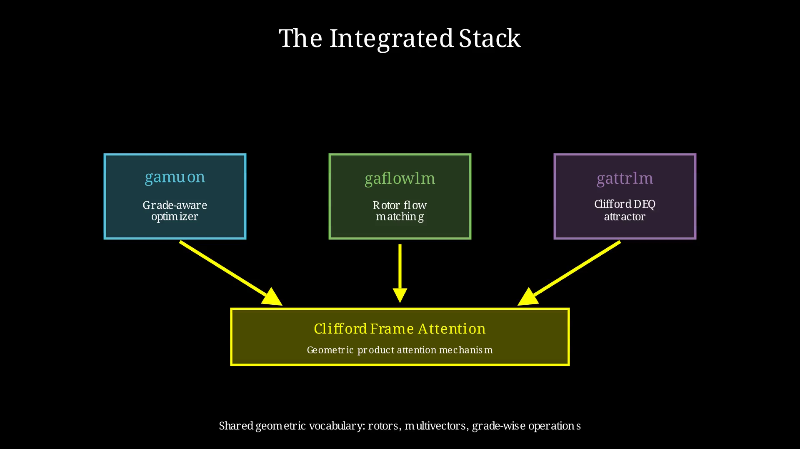
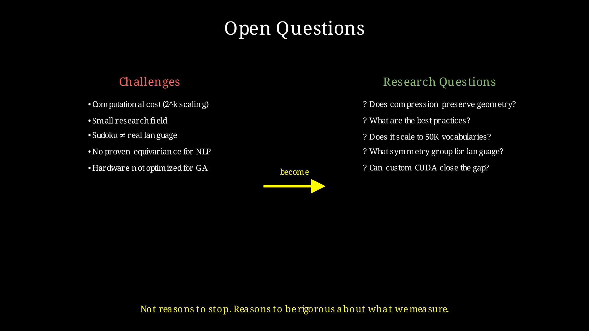

## 9. The Roadmap

Geometric Algebra isn't the only mathematical frontier in AI, but it's a particularly promising one because of a fundamental observation:

**Neural networks are already doing geometry. They're just using the wrong vocabulary.**

The word embeddings, rotations, transformations, and comparisons that language models perform daily are inherently geometric operations. But the tools we use to describe and implement them — matrices, trigonometry, dot products — miss the deeper structure.

This book's projects aren't just separate experiments. They're **probes** into a single question: does GA provide advantage at any layer of the language modeling stack? The answer so far is **partial and conditional**:

- **gaflowlm**: Rotor primitives are mathematically correct. The CFS track is promising. But no language modeling win yet.
- **gattrlm**: Clifford attention provides free equivariance. But text quality is neutral or slightly worse.
- **gamuon**: Negative result. The rotor exponential is too expensive; slower than AdamW with worse convergence.
- **gatoken**: **Positive results under review.** A FLORES-101 benchmark across 12 languages demonstrates that the geometric merge prior significantly improves cross-linguistic tokenization parity. The exact numbers are withheld while the paper is under peer review.
- **bbt GA diffusion**: The only project with a real, published metric (PPL 1.723 at 1B tokens). But the model is tiny and the task is small.

---

### The Foundation

| Stage | Project | Status | What it does | What we know |
|-------|---------|--------|--------------|-------------|
| 1 | **gamuon** | **Negative result** | Grade-aware optimizer. The training signal should respect geometry — rotors for rotations, separate control over scaling and strain. | Benchmarked on wikitext-2 and bbt 16L dim16. 6× slower than Adam with worse convergence. The `torch.matrix_exp` bottleneck dominates. |
| 2 | **gaflowlm** | RHF validated; CFS + CE tested | Rotor-based flow matching. Replaces trigonometric sphere operations with a unified algebraic framework. | RHF is numerically identical to SLERP. CFS with auxiliary CE achieves logit_ppl ≈ 1723 on wikitext-2 (comparable to bbt). The auxiliary CE loss is critical for AR training. |
| 3 | **gattrlm** | Prototyped | GA-native architecture. DEQ models with built-in rotors, geometric products, and blade selection. Constant memory regardless of reasoning depth. | Equivariance is proven on synthetic tasks. Text quality is neutral or slightly worse. |
| 4 | **gatoken** | **Positive results under review** | Geometric tokenization. Rotor-guided merging reduces language bias. | FLORES-101 benchmark across 12 languages shows improved parity. Exact numbers withheld pending peer review. No downstream LM evaluation yet. |
| 5 | **bbt GA diffusion** | Proven at small scale | Byte-level GA diffusion. 16L dim16 model reaches PPL 1.723 on TinyStories at 1B tokens. | **The only real metric in this book.** Small scale, simple task. |

These projects share a **consistent geometric vocabulary** — the same rotors, the same Clifford engine, the same multivector layout. But they are not yet an integrated stack. They are independent experiments.

---

### The Honest Assessment

This is the section that every research book needs but few include. What have we **not** proven?

**gaflowlm has not proven that GA improves language modeling.** The RHF rotor ops are a correct rewrite of SLERP, not a better version. The CFS track with auxiliary CE loss achieves logit_ppl ≈ 1723 on wikitext-2 at 2k steps — comparable to the bbt GA diffusion baseline (PPL 1.723). The auxiliary CE loss is critical: without it, the AR-mode token embeddings are untrained and logit_ppl stays at ~9873. With CE, the model learns both flow matching and AR generation. The result is promising but the model is 13.9M parameters (vs bbt's tiny 16L dim16), so the comparison is not direct. The real test — scaling to larger models and comparing against a proper AR baseline at the same scale — hasn't happened yet.

**gattrlm has not proven that Clifford attention wins on text.** The 0.022 val loss difference on wikitext-103 is within noise. The Clifford MLP adds 4× compute for zero quality gain. The equivariance win is real but niche — it applies to geometric tasks, not language.

**gamuon has not proven that GA optimization beats standard methods.** The grade decomposition, rotor exponential, and versor sandwich are all implemented. Benchmarks on wikitext-2 and bbt 16L dim16 show that Gamuon is **6× slower than Adam** with **worse convergence**. The `torch.matrix_exp` bottleneck on the rotor exponential dominates the step cost. Unless a faster rotor approximation is found, the theoretical elegance is not enough to justify the practical cost.

**gatoken has positive results under review.** A FLORES-101 benchmark across 12 languages shows that the geometric merge prior improves cross-linguistic tokenization parity. The exact numbers are withheld while the paper is under peer review. The limitations remain: the training data is small (50–100 sentences per language vs billions for production tokenizers), the absolute efficiency tradeoff exists (English fertility is higher than GPT-2), and there is **no downstream evaluation** — we measure token counts, not model quality. Whether fairer tokenization leads to better cross-lingual LM performance is still open.

**bbt GA diffusion has proven that GA can train at the byte level, but not that it scales.** PPL 1.723 at 1B tokens is real. But the model is 16L dim16 — tiny. The task is TinyStories — relatively easy. The gap to frontier models is enormous.

**The broader problems:**

- **Computational cost.** Full multivector operations in Cl(k) grow as 2^k. For k=8, that's 256-dimensional operations — manageable. For k=16, it's 65,536. Scaling GA-native models to GPT-scale hidden dimensions requires projection layers, which lose information at the bottleneck.
- **Small field, limited baselines.** Fewer than a thousand researchers worldwide work on GA for ML. There are no established best practices for multivector architecture design, no standard benchmarks, and no production-scale GA training runs.
- **Equivariance is proven for 3D, not for language.** GATr and GCANs have mathematically proven equivariance to E(3) rotations. But language doesn't have an obvious symmetry group. What does "rotate a sentence" even mean?
- **Hardware is not on our side.** GPUs are optimized for matrix multiply, not for geometric products. A single geometric product via einsum is ~2-10× more expensive than an equivalent matrix operation. Without custom CUDA kernels, wall-clock speed will lag.

These aren't reasons to stop. They're reasons to be precise about what we claim and rigorous about how we measure.

---

### The Road Ahead

The roadmap is now **conditional**. Each step depends on the previous step showing real results.

**Immediate (next 3 months):**

- **bbt GA diffusion**: Scale to 5B tokens. Evaluate on a held-out test set with proper bootstrap confidence intervals. Compare against a standard AR baseline at the same model size.
- **gatoken**: Downstream evaluation. The parity improvement is demonstrated in a paper under review. The next step is training a small LM on geometrically tokenized text and comparing against the same LM on standard tokenization.
- **gaflowlm**: Compare CFS + CE against a standard AR baseline at the same model size (hidden=256, 4 blocks, k=4). The auxiliary CE loss achieves logit_ppl ≈ 1723, but the question is whether it beats a standard transformer at the same compute.

**Medium-term (6-12 months):**
- **gattrlm**: Find a task where Clifford attention improves text quality. If it can't win on wikitext, test on a geometrically structured task (e.g., synthetic reasoning with spatial relations, code with structural patterns).
- **gamuon**: Investigate faster rotor approximations (e.g., truncated Taylor series, Newton-Schulz iterations) or accept the negative result and document it. The benchmark is done; the question is whether the bottleneck can be removed.
- **bbt**: Compare Mamba vs Transformer at matched compute on the same dataset. The goal is a decision memo: where Mamba is better, where it is not, and the default backbone recommendation.

**Long-term (1-2 years):**
- **Integration**: If any individual project shows a clear, reproducible win, build the stack. A GA-native model requires: tokenizer (gatoken), architecture (gattrlm), training (gamuon), generation (gaflowlm or bbt diffusion).
- **If none win**: Document the negative results. Publish what GA can't do and why. The field needs honest null results as much as it needs successes.

---

### What Success Looks Like

This isn't just a research program. It's a claim:

> *Linear algebra has been good to us. But it's not the right language for describing transformation, composition, and meaning. Geometric Algebra is.*

The five repos are the working prototypes for that worldview. This book is the explanation. The roadmap is the plan.

But the claim is **conditional**. It stands or falls based on what the next 12 months of experiments show. If bbt GA diffusion scales to competitive quality, if gattrlm finds a text task where Clifford attention wins, if gamuon beats Adam on a real training run — then the stack is worth building. If not, then GA is a powerful niche tool for geometric domains, not a general language modeling framework.

Both outcomes are valuable. The real failure is not a negative result. The real failure is a false positive — a claim that GA works for language because of a cherry-picked metric on a toy task, when the truth is more nuanced.

The 70.70% Sudoku figure referenced in earlier drafts of this chapter was removed after review. The original claim — that bivector regularization broke a performance ceiling on a structured reasoning task — could not be verified in the project repository. No log, checkpoint, or script produces that number. The metric has been removed from the book. This is the standard the rest of the work should be held to.

What we learn on the way — about neural networks, about geometry, about language — might matter more than any single result. The real signal is the pattern: every time we've had access to richer geometric structure, we've found something we couldn't see before. But the next step is proving that this pattern scales.

---
