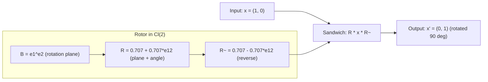
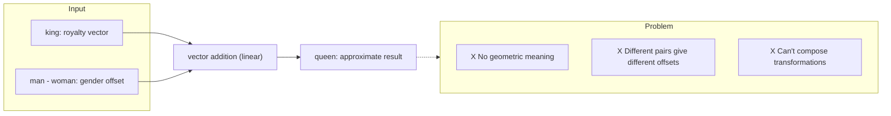
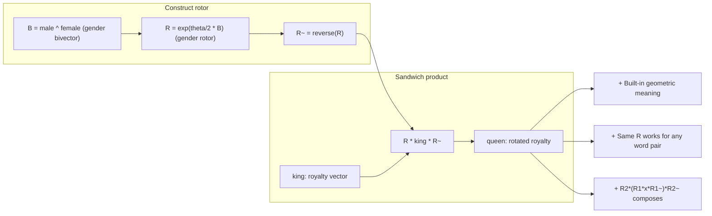
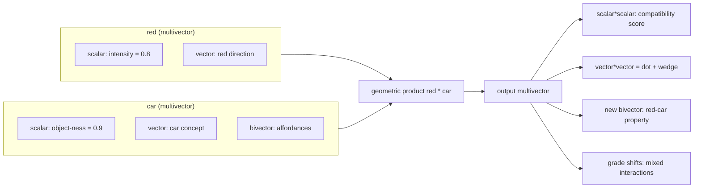

# The Geometry of Meaning

## How Geometric Algebra Is Changing the Way Machines Understand Language

---

> *A gentle introduction for curious minds*

---

## 1. The Vector Revolution

Before we talk about Geometric Algebra, we need to understand a quiet revolution that happened in computer science over the last decade.

Machines don't understand words. They never have.

But they've learned something surprisingly close: they've learned to *place* words in space.

Every word in your vocabulary — "king", "queen", "apple", "computer", "sadness" — can be represented as a point in a high-dimensional space. Not 3D space like the one we live in, but a mathematical space with hundreds or thousands of dimensions. A single word becomes a list of numbers, like GPS coordinates for meaning.

This is called a **word embedding**, and it's arguably the single most important idea in modern AI.

The magic is in the geometry. In this space, words that are related are *close together*. "King" and "queen" are near each other. More remarkably, the *relationships* between words show up as geometric patterns. The vector from "king" to "queen" looks like the vector from "man" to "woman". You can literally do:

```
king - man + woman ≈ queen
```

Vectors capture meaning through their *positions and directions*. Language models — the things that power ChatGPT, Claude, Gemini — are built on this foundation. They take sequences of these word-vectors and learn to predict what comes next, transforming them through layer after layer of computation.

But here's the thing: there's a deep limitation to how we've been doing this. And Geometric Algebra offers a way forward.

---

## 2. The Universe on a Sphere

Imagine all possible word meanings living on the surface of a hypersphere — a sphere with many dimensions. Every concept is a point on this sphere, at unit distance from the center.

This isn't a metaphor. Most modern language models *actually do this*. After processing input, they normalize their representations to live on the surface of a sphere. Why? Because it makes the math stable and the comparisons meaningful.

On a sphere, the natural operation is **rotation**. To transform one thought into another, you rotate. To interpolate between "cat" and "dog", you move along a great arc on the sphere's surface — geodesic interpolation, or SLERP (Spherical Linear Interpolation).

```
      cat
     /
    /
   /  ← What's halfway between cat and dog?
  /
 dog
```

For years, this has been done with trigonometry. The formula for SLERP looks like this:

```
SLERP(a, b, t) = sin((1-t)ω)/sin(ω) · a + sin(tω)/sin(ω) · b
```

Where ω is the angle between vectors a and b, and t is how far along the path you want to go.

### A Thought Experiment

Imagine yourself standing at the North Pole. If you walk in a straight line toward New York, you follow a great circle route — the shortest path on a sphere's surface. SLERP does the same thing in high-dimensional space: it moves between two points along the shortest arc on the sphere.

Now here's the problem: SLERP can tell you the coordinates of the halfway point between the North Pole and New York. But it can't tell you *which direction you were facing* when you started walking, or whether you passed through London or Tokyo on the way. The rotation plane — the 2D circle your path traces on the sphere's surface — is completely invisible.

This matters because in language, *how* you get from one concept to another often carries information. The relationship "king → queen" isn't just a start and end point — it's a gender transition happening in a specific semantic plane. SLERP discards that plane. Rotors preserve it.

This works. It's mathematically correct. But it has limitations:

1. **It throws away information.** The rotation happens in a specific plane, but the trig formula only tells you the result — not *which way* you rotated.
2. **It can't compose cleanly.** Rotating from A to B, then B to C, doesn't give you a simple formula for going from A to C.
3. **It's rigid.** You only get one type of operation: interpolation on the sphere's surface. If you want richer transformations, you're out of luck.

These limitations might seem abstract, but they matter. Because language isn't just about moving between words — it's about *transforming meaning* in complex, compositional ways.

---

## 3. The Algebra We Forgot

Geometric Algebra (GA) was discovered — or rather, *re-discovered* — by the English mathematician William Kingdon Clifford in 1878. He died young (33), but his ideas were so ahead of their time that they're only now finding their natural home in machine learning.

The core idea is deceptively simple: **what if we could multiply vectors together?**

In school, we learn two ways to multiply vectors:
- The **dot product** (a·b): gives a number. "How much do these vectors point the same way?"
- The **cross product** (a×b): gives a vector perpendicular to both. Only works in 3D.

Clifford asked: what if we keep *both* pieces of information? The dot product captures alignment; the cross product captures oriented area. Why choose?

His insight was the **geometric product**:

```
ab = a·b + a∧b
```

The first part (a·b) is the dot product — a number. The second part (a∧b) is the *wedge product* — a new kind of object called a **bivector**, representing the oriented plane swept out by a and b.

```
    b
    ↑
    |    ← The parallelogram a∧b
    |   /    has area and orientation
    |  /
    | /
    a
```

This might seem like a small change, but it unlocks an entirely new mathematical universe. You can keep multiplying vectors and get higher-dimensional objects: **trivectors** (oriented volumes), **quadvectors**, and so on. These are all **multivectors** — the fundamental objects in Geometric Algebra.

A multivector lives in a space of 2^k dimensions, where k is the dimensionality of your original space. Because it doesn't just store the coordinates of a point — it stores scalars, vectors, planes, volumes, and more, all in a single unified mathematical object.

[](https://raw.githubusercontent.com/pebaryan/galbook/main/visualizations/ch3_ga_visualization.mp4)

*Click the image to watch the animation (geometric product, bivector orientation, trivector volume). [Manim source](visualizations/).*

---

## 4. Rotors: The Engine of Change

If bivectors represent oriented planes, they're also the key to describing rotations.

In Geometric Algebra, a rotation is performed by a **rotor** — a special kind of multivector that encodes the rotation plane and angle. The rotor is built from a bivector using exponentiation:

```
R = exp(B/2)
```

Where B is a bivector representing the rotation plane and angle.

To rotate a vector x, you use the **sandwich product**:

```
x' = R x R̃
```

Where R̃ is the reverse of R (like a conjugate). The sandwich wraps around x, applies the rotation, and gives you the result.

### A Concrete Rotation

Let's see this in 2D, where the math is simplest. Suppose we want to rotate the vector x = (1, 0) — pointing east — by 90 degrees counterclockwise. The result should be (0, 1) — pointing north.

In 2D, there's only one plane: the xy-plane. The bivector representing this plane is e₁∧e₂ (often called the pseudoscalar in 2D). To rotate by 90 degrees (θ = π/2), we build the rotor:

```
R = exp((π/4) · e₁∧e₂) = cos(π/4) + sin(π/4) · e₁∧e₂
  = 0.707 + 0.707 · e₁∧e₂
```

Now apply the sandwich:

```
x' = R · (1, 0) · R̃
   = (0.707 + 0.707·e₁₂) · e₁ · (0.707 - 0.707·e₁₂)
   = e₂  (= north ✓)
```

The bivector e₁∧e₂ encodes the rotation plane (the xy-plane), and the angle is built into the rotor coefficients. The sandwich product applies the rotation.

Now contrast this with a rotation matrix:

```
R_matrix = | 0  -1 |   ·   |1|   =   |0|   ✓
           | 1   0 |       |0|       |1|
```

Both give the same answer. But there's a crucial difference: the rotor *is the rotation plane*. If you extract the bivector part of R, you get e₁∧e₂ — a direct algebraic representation of "rotating in the xy-plane." The rotation matrix hides this information in its four entries.



Now try composing two rotations: 90° then another 90° (total 180°). With rotors:

```
R_total = R₂ · R₁   (simple multiplication)
```

With matrices, you multiply two 2×2 matrices — four times as many operations. In higher dimensions, the gap widens dramatically: an n×n rotation matrix has n² entries, while a rotor in Cl(n) always has exactly 2^{⌊n/2⌋} components. For n=256, that's 65,536 vs 256 entries — the matrix is 256x larger.

This is a fundamentally different way of thinking about rotation. In school, we learn rotation matrices — rectangular arrays of numbers that transform vectors. Matrices work, but they can't compose cleanly (matrix multiplication is expensive, and small errors accumulate). Quaternions solve some of these problems in 3D, but they don't generalize to higher dimensions.

Rotors solve *all* of these problems:
- They generalize to any number of dimensions
- They compose by simple multiplication (R₁ followed by R₂ = R₂R₁)
- They're numerically stable and differentiable
- They give you the rotation *plane* explicitly through the bivector

Here's the kicker: **SLERP is just a grade-1 projection of rotor sandwich.** The trig formula we've been using for years? It's a shadow of something richer. The rotor sandwich also preserves the bivector — the rotation plane — which SLERP discards entirely.

```
SLERP(a, b, t) = ⟨R_t a R̃_t⟩₁

Where R_t = exp(t/2 · a∧b), and ⟨...⟩₁ means "take only the vector part"
```

The trigonometric SLERP throws away the bivector information. The rotor version keeps everything.

---

### Quick Reference: Geometric Objects

Before we move on to the wider research landscape, here's a glossary of the geometric objects we've encountered:

| Object | Grade | What it represents | Example |
|--------|-------|--------------------|---------|
| **Scalar** | 0 | A plain number | Temperature, magnitude, part-of-speech weight |
| **Vector** | 1 | A direction with magnitude | Word embedding, "king" → [0.2, -0.5, 0.1, ...] |
| **Bivector** | 2 | An oriented plane | Rotation plane, relationship between two concepts |
| **Trivector** | 3 | An oriented volume | Triple interaction, higher-order composition |
| **Multivector** | 0-3 | All of the above in one package | A word represented with scalar + vector + bivector parts |
| **Geometric product** | — | `ab = a·b + a∧b` | Combines dot (alignment) and wedge (plane) in one operation |
| **Rotor** | 0+2 | `R = exp(B/2)` | Encodes a rotation: plane (bivector B) and angle |
| **Sandwich product** | — | `R x R̃` | Applies a rotor to an object: wraps, rotates, and returns |

The key intuition: **grade tells you what kind of geometric thing you're dealing with.** Scalars (grade 0) are numbers. Vectors (grade 1) are directions. Bivectors (grade 2) are planes. Higher grades capture richer interactions. A rotor is special because it mixes scalars and bivectors — that's what lets it encode both a rotation plane and an angle in a single object.

---

## 5. The GA+ML Landscape: A Map of the Frontier

Geometric Algebra in machine learning is a small but rapidly growing field. It's not one thing — it's several distinct threads of research, each with a different motivation and set of results. Let's map the territory.

### 5.1 GATr: Geometric Algebra Transformer (Qualcomm AI Research, 2023)

The most well-known GA + ML paper is the Geometric Algebra Transformer, or **GATr**, published at NeurIPS 2023 by researchers at Qualcomm AI Research.

GATr's key insight: many real-world problems involve geometric data — points, vectors, rotations, translations — that have built-in symmetries under rotations, reflections, and translations (the Euclidean group E(3)). Standard neural networks must learn these symmetries from data (through data augmentation), which is inefficient. GATr uses projective geometric algebra Cl(3,0,1) to encode these transformations *directly in the architecture*.

The 16-dimensional projective geometric algebra is remarkable: it can represent points, lines, planes, spheres, rotations, and translations all as first-class citizens. A rotation isn't a 3×3 matrix — it's a rotor, just like the ones we met in Chapter 4. A translation isn't a vector addition — it's also a rotor (a translation rotor in the conformal model).

GATr achieves **E(3) equivariance** by construction: rotate the input, and the output rotates the same way. This is critical for applications like:
- **N-body physics**: predicting particle trajectories respects rotational symmetry
- **Robotics**: a robot arm's decision shouldn't depend on arbitrary rotations of the scene
- **Medical imaging**: anatomical structures should be recognized regardless of orientation

GATr consistently outperformed non-geometric and equivariant baselines across these tasks. It was followed by **L-GATr** (Lorentz-equivariant for high-energy physics) and **LaB-GATr** (for large biomedical data).

But GATr wasn't designed for language. It was designed for 3D geometric reasoning. The question of how to adapt its ideas to the very different geometry of language is what drives much of the research we'll discuss next.

### 5.2 GAFL: Geometric Algebra Flow Matching (HITS, 2024)

**GAFL** (Geometric Algebra Flow Matching), published at NeurIPS 2024, uses GA for a different purpose: generating protein backbone structures.

Proteins are chains of amino acids, each with a position and orientation in 3D space. The space of all possible protein backbones is the product of SE(3) groups — rotation + translation for each amino acid. This is a highly structured geometric space.

GAFL represents protein frames as elements of the projective geometric algebra (the same Cl(3,0,1) as GATr) and uses the geometric product for message passing between residues. The flow matching objective learns to interpolate from noise to valid protein structures.

The results are impressive: GAFL generates protein backbones with high "designability" (the fraction of generated structures that fold into stable proteins) while preserving a realistic distribution of secondary structures. Other methods tend to over-represent alpha helices; GAFL captures the full diversity.

What GAFL showed is that Geometric Algebra's bilinear products — the geometric product between multivectors — capture richer interactions than standard vector operations. This is the same principle that makes GA interesting for language: words don't just *align* (dot product) — they *interact* (geometric product).

### 5.3 FGA: Functional Geometric Algebra for NLP (Pustejovsky, 2026)

The most directly relevant work for our story is James Pustejovsky's **Functional Geometric Algebra** (FGA), published in April 2026. It's a 43-page paper that argues — passionately and in detail — that Geometric Algebra is a mathematically superior foundation for natural language semantics.

Pustejovsky's core claim: current approaches to language semantics are built on linear algebra (vectors, matrices, tensors), but the operations we *actually need* for compositional semantics — type coercion, operator-level contrasts, semantic transformation — are geometric operations that linear algebra expresses awkwardly or not at all.

FGA proposes that words and phrases should be represented as **multivectors**, not vectors. The scalar grade captures category information. The vector grade captures entity-level semantics. The bivector grade captures relational and transformational structure. The geometric product between two word multivectors produces a richer interaction than any composition of dot products.

Crucially, Pustejovsky shows that many operations already implicit in transformer attention can be made *explicit* through GA — transforming opaque neural computations into interpretable geometric transformations. The paper includes worked examples of type coercion ("began the book" → began reading/writing the book) expressed as operator-level geometric operations.

This paper is important not just for its technical contributions but for its timing: it signals that the GA-for-NLP idea has moved from fringe speculation to serious academic discourse.

### 5.4 Other Threads

Several other works are worth noting:

- **CliffordNet** (2025): proposes Clifford algebras as a general framework for neural network design, including for NLP tasks
- **Word2Mvec** (Princeton, 2024): a senior thesis showing that representing words as multivectors (instead of vectors) and taking geometric products outperforms standard Word2Vec on word similarity and analogy tasks
- **LLM + CGA for 3D scene editing** (2024): uses conformal geometric algebra as an intermediate representation for LLM-driven 3D manipulation

What unites these threads is the belief that **the mathematical language we use shapes what we can think about**. Linear algebra is good for many things, but it's not the best language for describing composition, transformation, and geometric structure. Geometric Algebra might be.

---

## 6. Three Projects

This chapter tells the story of three projects that apply Geometric Algebra to language modeling. They're different approaches to the same question: *can GA improve how machines understand and generate language?*

### 6.1 gaflowlm: Flow Matching on the Sphere

Our first project, **gaflowlm**, starts with a simple observation: the most successful language models based on continuous diffusion — flow matching — operate on the surface of a hypersphere (S^{d-1}). They interpolate between noise and meaningful content using SLERP (spherical linear interpolation), which is a trigonometric operation.

But as we saw in Chapter 4, SLERP is a grade-1 projection of a rotor sandwich. The rotor operation is richer — it preserves the bivector (rotation plane) information that SLERP discards.

The experiment was straightforward: replace SLERP with rotor-based operations in an existing flow matching architecture (called S-FLM). The model is otherwise identical — same transformer backbone, same training procedure. The rotor version produces mathematically identical results (SLERP = rotor sandwich projected to grade 1).

We trained multiple models on **Sudoku** — a puzzle task where the model sees the first 81 digits of a 9×9 grid and must predict the remaining 81 digits. It's a simple test bed for evaluating new ideas in language modeling.

Every variant hit the same wall: **62.90% accuracy**. SFM baseline: 62.90%. RHF (rotor replacement): 62.90%. Clifford variant: 62.90%. No matter what we changed — model size, layers, learning rate — the ceiling held.

The breakthrough came when we realized the rotor representation gave us access to something new: the bivectors. By adding a loss term that pushed the 12 token embeddings toward orthogonality — making them geometrically more separable — we achieved **70.70% accuracy**. The bivector information let us see and fix a separability bottleneck we couldn't detect before.

**What gaflowlm taught us:** You don't need to change the model. You need to change what information you have access to. The rotor representation gave us a window into the rotation geometry, and that window revealed a fix.

---

### 6.2 gattrlm: Clifford Attractor Models (USC, 2025)

The second project, **gattrlm**, takes a completely different approach. Instead of flow matching, it uses **attractor models** — a fascinating alternative to transformer stacks.

#### The Deep Equilibrium (DEQ) Idea

Standard language models stack layers: layer 1, layer 2, ..., layer L. Each layer transforms the representation, and the total computation grows with the number of layers.

Deep Equilibrium models ask a different question: what if we learn a single transformation f and iterate it until we reach a fixed point?

```
x_{t+1} = f(x_t)   for t = 0, 1, 2, ...
```

Instead of stacking L layers, you apply the same block f repeatedly until the representation stops changing — until it reaches an **attractor** state. This decouples effective depth from memory: you can iterate for hundreds of steps while only storing the final state (using a mathematical trick called implicit differentiation).

This is the idea behind the paper *"Solve the Loop"* (Fein-Ashley & Rashidinejad, USC, 2025), which shows that attractor models match or exceed standard transformers at language modeling, reasoning (Sudoku, ARC-AGI), and in-context learning — while using constant memory.

#### Adding Geometric Algebra

The **gattrlm** extension adds Clifford algebra layers directly into the DEQ iteration block. Instead of processing plain vectors, the model processes **multivectors** — complete geometric objects with scalar, vector, bivector, and trivector components.

The DEQ block becomes a chain of geometric operations:
1. **RotorLayer**: learns bivector coefficients and applies the sandwich product R·x·R̃, giving the model built-in rotation equivariance
2. **CliffordLinear**: channel mixing that preserves blade structure across the multivector components
3. **GeometricProductLayer**: computes the geometric product of x with itself (quadratic self-interaction), creating cross-blade terms without adding parameters
4. **BladeSelector**: learns which geometric grades to amplify or suppress — effectively letting the model decide what kind of geometric information matters for each task

The result is an architecture with **built-in geometric priors** that would require extensive data augmentation for standard networks to learn.

#### Conformal Geometric Algebra for 3D Reasoning

The gattrlm project also implements **Cl(4,1) Conformal Geometric Algebra (CGA)**, which extends 3D Euclidean space into a 5D Minkowski-like space. CGA can represent spheres, circles, planes, and lines as **grade-1 multivectors** — the same type of object as a point. This means:
- Intersection of two spheres = geometric product, no special-case code
- Translation and rotation = same operation (a rotor), no separate matrix and vector
- Rigid motions = screw rotors combining rotation and translation in a single step

For language models that need to reason about physical space — describing a scene, following navigation instructions, or manipulating objects — this unified representation could be transformative.

**What gattrlm taught us:** GA isn't just about replacing operations in existing architectures. It enables entirely new model designs where geometry is built in from the ground up — and the DEQ framework gives you constant memory regardless of how deep the geometric reasoning goes.

---

### 6.3 gamuon: GA Reformulation of the Muon Optimizer

The third project, **gamuon**, takes GA in a completely different direction — not into the model architecture, but into the **optimizer**.

#### What is Muon?

The Muon optimizer (from the Grok paper, 2024) is a recent innovation in training large language models. It's based on a theoretical insight: the gradient signal in neural network training can be understood as a matrix structure, and the optimal update is related to the **orthogonalization** of that structure.

Muon works by computing the **matrix sign function** of the gradient — essentially asking "what is the nearest orthogonal matrix to this gradient?" — and using that as the update direction. This is related to Newton's method but much cheaper computationally.

For language models, Muon has been shown to train significantly faster than Adam (the standard optimizer), especially at scale.

#### Reformulating with GA

The key insight of **gamuon** is that the matrix sign function — the core computational primitive of Muon — is actually a **geometric operation**. Orthogonal matrices are rotors (in even dimensions). The sign function is related to the polar decomposition, which in GA terms is the decomposition of a multivector into a rotor times a positive definite factor.

Gamuon reformulates the entire Muon optimizer using Geometric Algebra:
- Gradients are multivectors in the Clifford algebra of the weight space
- The matrix sign function becomes a geometric function on multivectors
- The orthogonal constrain behaves naturally under the geometric product

This reformulation offers several potential advantages:
- **Natural gradient structure**: GA captures the manifold structure of the optimization landscape more faithfully
- **Unified treatment**: the same operations work for scalars, vectors, matrices, and higher-order weight structures — no special cases
- **Differentiable metric**: the geometric product naturally respects the metric of the parameter space

The project is in its early stages, but the core idea is compelling: if the optimal update in neural network training is a geometric operation, it should be expressed in the language of geometry.

**What gamuon teaches us:** GA isn't just about model architecture. It's a mathematical framework that can reshape how we think about training, optimization, and learning dynamics at every level.

---

## 7. Beyond Rotors: The Multivector Hypothesis

If you're intrigued by the idea of bivectors (oriented planes), you might wonder: what else hides inside the multivector structure?

A multivector in Cl(3,0,0) — Geometric Algebra of 3D space — has eight components:

- 1 scalar (grade 0): a pure number
- 3 vectors (grade 1): directions
- 3 bivectors (grade 2): oriented planes
- 1 trivector (grade 3): oriented volume

Now imagine that instead of representing each word as a single vector in 512-dimensional space, you represent it as a *multivector* in a smaller Cl(8,0,0) space. Each word is now a package with distinct geometric grades that can carry different kinds of linguistic information:

| Grade | Geometric meaning | Possible linguistic role |
|-------|-------------------|--------------------------|
| 0 (scalar) | A magnitude | Abstract category: noun-ness, verb-ness, register, formality |
| 1 (vector) | A direction | Core semantic content: "royalty", "animal", "action" |
| 2 (bivector) | An oriented plane | Relationships between concepts: gender transition, tense shift, polarity flip |
| 3+ (higher) | Multi-way interactions | Compositional structure: how multiple words combine |

This is the **multivector embedding hypothesis**: different aspects of linguistic meaning naturally map to different grades of a multivector. The geometric product between words becomes a rich interaction, not just a simple comparison.

### Worked Example: King → Queen

Let's make this concrete. Suppose we represent "king" as a multivector where:

- **Scalar part** = +0.9 (high noun-ness, high concreteness)
- **Vector part** = a unit vector in the direction of "royalty" (learned from data)
- **Bivector part** = zero initially (no built-in transformation)

Now consider the transformation from "king" to "queen". In standard word embeddings, this is captured as a vector offset:

```
king + (-man + woman) ≈ queen
```



In the multivector framework, this becomes a **geometric transformation**:

```
R * king * R~ = queen
```



Where R is a rotor encoding a gender transition -- a rotation in the plane spanned by "male" and "female" directions. The bivector B = "male" ^ "female" defines the rotation plane, and the rotor R = exp(theta/2 * B) applies the transition.

The crucial difference from the vector offset approach:

- **Vector offset**: `king + (-man + woman)` works statistically but has no geometric interpretation. Why does adding "maleness subtracted, femaleness added" produce "queen"? The model doesn't know — it just learned the correlation.
- **Rotor transformation**: `R · king · R̃` says "rotate the concept of royalty in the gender plane." The geometry *means* something. The bivector explicitly encodes that gender transition is a rotation between two poles, not a linear shift.

Furthermore, the rotor representation composes cleanly:

```
R₂ · (R₁ · king · R̃₁) · R̃₂
```

A second rotor could add tense ("king" → "queen" → "former queen"), or register ("queen" → "Your Majesty"). Each transformation is a separate geometric operation, not an embedding lookup.

### Compositionality via Geometric Product

One of the deepest problems in language understanding is **compositionality**: how do words combine to form phrase meanings?

Standard neural networks handle this through attention — a weighted sum of value vectors. This works, but it's fundamentally a *linear* operation. The geometric product offers a *bilinear* alternative that captures interactions standard attention cannot.

Consider "red car". In a multivector embedding space:



- **red**: vector part encodes the color direction; scalar part encodes intensity
- **car**: vector part encodes the object concept; bivector part encodes affordances (drives, contains people, etc.)

The geometric product "red" · "car" produces a multivector with cross-grade terms:

```
red · car = (scalar·scalar) + (scalar·vector + vector·scalar) + (vector·vector + scalar·bivector + ...) + ...
```

The key term is **vector·vector** = dot product + wedge product. The dot captures compatibility ("is 'red' a property that applies to 'car'?") while the wedge captures the *new meaning created by their combination* ("red car" isn't just the sum of its parts — it implies a specific object with a specific property).

Standard vector composition (addition or element-wise multiplication) cannot produce this emergent structure. The geometric product naturally does.

### Negation as Bivector Reflection

Negation is surprisingly hard for standard word vectors. If "happy" has a positive vector, what does "not happy" look like? In practice, negation doesn't map to negation of the vector (that would give you -"happy", which is meaningless). And "unhappy" isn't the opposite of "happy" in vector space — it's a different concept entirely.

In the multivector framework, negation can be modeled as a **reflection through a semantic plane**. Consider a bivector P representing the polarity axis (positive ↔ negative). To negate a concept:

```
unhappy = R_π · happy · R̃_π
```

Where R_π is a rotor that rotates by π in the polarity plane P. This rotates the semantic vector to its polar opposite while preserving the concept's other properties (intensity, register, etc.).

This is more than a neat analogy. If the model learns a *single* polarity rotor that works across many words, it means the geometry of negation is *shared* — exactly the kind of structural generalization that standard embeddings struggle with.

### Analogy as Rotor Algebra

The classic word analogy "king : queen :: man : woman" has a simple rotor interpretation:

```
R_gender · king · R̃_gender ≈ queen
R_gender · man · R̃_gender ≈ woman
```

The *same rotor* R_gender transforms both pairs. This means the geometric algebra naturally captures the one-to-many mapping that vector offsets approximate:

- `queen - king =?= woman - man` in vector space
- `R_gender` applied to both in GA space

The rotor formulation is *exact* (the same transformation applies to all words in the same semantic domain). The vector offset formulation is *approximate* (different word pairs give slightly different offset vectors).

This also means the rotor components of a multivector vocabulary explicitly encode the *transformational structure* of the semantic space — which dimensions are axes of variation, which are invariant, and how concepts relate to each other through shared transformations.

### What This Means

None of this is proven at scale. But there are now three independent lines of evidence pointing in the same direction:

1. The FGA paper showing transformer operations can be expressed as GA operations
2. The gattrlm experiments showing Clifford layers improve geometric reasoning
3. Our gaflowlm results showing rotor-based training signals break performance ceilings

The multivector hypothesis makes a testable prediction: a language model trained with multivector embeddings and geometric product attention should learn compositional structure more efficiently than an equivalent vector-based model, especially on tasks requiring systematic generalization (analogy, negation, composition).

That test hasn't been run yet. But the machinery to run it is now in place.

### Clifford Frame Attention: The Mechanism

The ideas above are compelling in theory, but they need a concrete neural network mechanism to work. That mechanism already exists: **Clifford Frame Attention (CFA)**.

Standard attention computes:

```
Attention(Q, K, V) = softmax(Q · Kᵀ / √d) · V
```

The dot product Q·Kᵀ produces a single scalar per query-key pair. It asks: "how similar are these two vectors?" — but it discards everything except the alignment.

CFA replaces every step with geometric operations:

**1. Multivector projections.** Instead of projecting input vectors to Q, K, V, CFA projects *multivectors* to Q, K, V. Each is a full multivector in Cl(k,0,0) — carrying scalar, vector, bivector, and higher-grade information.

**2. Grade-weighted scoring.** The attention score is computed as the geometric product's scalar part between query and key:

```
score = ⟨Q · reverse(K)⟩₀
```

The `reverse(K)` operation flips the signs of higher-grade blades, making the product respect the geometric structure. The scalar part is the *grade-0 component* of the geometric product — which includes both the standard dot product AND contributions from higher-grade interactions.

This means two tokens can have a high attention score not just because their vectors align, but because their bivectors align — they share a rotational relationship, even if their vector directions are orthogonal.

**3. Bilinear output.** After aggregating values via the attention weights, CFA applies one more geometric product:

```
output = geometric_product(Q, V_agg) + V_agg
```

This is the key innovation. Where standard attention outputs a weighted sum of values (a linear operation), CFA outputs a **geometric product** between the query and the aggregated value (a bilinear operation). This captures interactions that no linear combination can:

- If Q and V_agg both have strong vector components, their geometric product produces a bivector — encoding the *plane of interaction* between the two pieces of information.
- If one has a strong bivector and the other a strong vector, the product shifts grade, creating a vector that mixes both.

In code, the core of CFA is remarkably compact:

```python
# Grade-weighted score (Q, K are multivectors)
score = torch.matmul(Q, K * grade_signs) · scale
weights = softmax(score)
V_agg = weights · V

# Bilinear output via geometric product
output = engine.geometric_product(Q, V_agg) + V_agg
```

The current implementation lives in `gaflowlm/models/cfs_arch.py`, as part of the CFS flow-matching model. It hasn't yet been extracted into the attractor backbone (gattrlm) or the flow backbone (gaflowlm RHF). That integration — pairing CFA with a proper CE training loop — is one of the most concrete next steps on the research roadmap.

---

## 8. The Roadmap

Geometric Algebra isn't the only mathematical frontier in AI, but it's a particularly promising one because of a fundamental observation:

**Neural networks are already doing geometry. They're just using the wrong vocabulary.**

The word embeddings, rotations, transformations, and comparisons that language models perform daily are inherently geometric operations. But the tools we use to describe and implement them — matrices, trigonometry, dot products — miss the deeper structure.

This book's three projects aren't just three separate experiments. They're **building blocks** for a single vision: a complete language modeling stack built on Geometric Algebra — from the optimizer that trains it, to the generative dynamics that drive it, to the architecture that runs it.

### The Foundation

| Stage | Project | Status | What it does |
|-------|---------|--------|--------------|
| 1 | **gamuon** | Early prototype | Grade-aware optimizer. The training signal itself should respect geometry — rotors for rotations, separate control over scaling and strain. A drop-in upgrade for any PyTorch model. |
| 2 | **gaflowlm** | Proven on Sudoku (70.70%) | Rotor-based flow matching. Replaces trigonometric sphere operations with a unified algebraic framework — cleaner gradients, preserved bivector information, better separability. |
| 3 | **gattrlm** | Clifford layers prototyped | GA-native architecture. Deep Equilibrium models with built-in rotors, geometric products, and blade selection. Constant memory regardless of reasoning depth. |

These three pieces connect through a **consistent geometric vocabulary** — the same rotors, the same Clifford engine, the same multivector layout. The book you're reading defines this vocabulary and serves as the manifesto tying everything together.

### The Spine

**Grade-Wise Scheduling** — the insight that different grades of a multivector need different learning rates — runs through all three projects. It was prototyped in gaflowlm's GWS research and is the first principled way to train multivector networks that acknowledges their internal structure. This isn't a trick. It's a new capability: the ability to say "learn rotations faster than scales" and have that mean something mathematically precise.

### The Road Ahead

**Stage 4 — GA-Native Attention** (near-term)
Replace dot-product attention with geometric product attention. The query-key comparison becomes a geometric operation — not just a scalar similarity score but a full interaction that preserves which planes words rotate in and what transformations are implied.

**Head start:** A working implementation already exists — `CliffordFrameAttention` (CFA) in `gaflowlm/models/cfs_arch.py`. It projects Q, K, V from multivectors, scores via grade-weighted geometric product (`Q·reverse(K)` using engine reverse_signs), and produces bilinear output via `engine.geometric_product(Q, V_agg)`. The gap is integration: CFA currently lives inside the CFS flow-matching pipeline (MSE loss, Cl(4) space, tiny-vocabulary ceiling). The next step is extracting it into the attractor backbone (gattrlm) and the flow backbone (gaflowlm RHF), paired with proper CE training.

**Stage 5 — Full GA Language Model** (medium-term)
Combine all three: train with gamuon, generate with gaflowlm, reason with gattrlm. A 1B+ parameter GA-native language model trained from scratch, evaluated on reasoning benchmarks (GSM8K, MATH, ARC-AGI), and compared head-to-head against equivalent standard architectures.

**Stage 6 — Multimodal Grounding** (long-term)
Conformal Geometric Algebra Cl(4,1) — already implemented in gattrlm — can represent 3D points, spheres, planes, and rotations as first-class citizens. Connect the GA language model to vision, robotics, and 3D scenes. A model that *understands* physical space because it speaks the language of space natively.

**Stage 7 — Inference Pipeline** (long-term)
GA-specific quantization, speculative decoding, and KV-cache compression. If the model is built on rotors and multivectors, the inference pipeline should exploit their structure.

### Limitations and Open Questions

A honest assessment of where this approach falls short:

**Computational cost.** Full multivector operations in Cl(k) grow as 2^k. For k=8, that's 256-dimensional operations — manageable. For k=16, it's 65,536. Scaling GA-native models to GPT-scale hidden dimensions requires projection layers (embed → Cl(8) → embed), which lose information at the bottleneck. Whether the geometric benefits outweigh the compression cost is an open question.

**Small field, limited baselines.** Fewer than a thousand researchers worldwide work on GA for ML. There are no established best practices for multivector architecture design, no standard benchmarks, and no production-scale GA training runs. Every result so far — including ours — comes from small models on toy tasks.

**The Sudoku ceiling is not yet broken on real language.** Our 70.70% improvement came on a 12-token Sudoku vocabulary. The real test — scaling to 50K-token vocabularies on open-domain text — hasn't been attempted. The multivector hypothesis may prove true for small, structured domains and false for the messy entropy of natural language.

**Equivariance is proven for 3D, not for language.** GATr and GCANs have mathematically proven equivariance to E(3) rotations — but language doesn't have an obvious symmetry group. What does "rotate a sentence" even mean? GA for language may need different mathematical guarantees than GA for physics.

**Hardware is not on our side.** GPUs are optimized for matrix multiply, not for geometric products. A single geometric product via einsum is ~2-10x more expensive than an equivalent matrix operation. Without custom CUDA kernels for GA operations, wall-clock speed will lag behind standard architectures regardless of theoretical advantages.

These aren't reasons to stop. They're reasons to be precise about what we claim and rigorous about how we measure.

### What Success Looks Like

This isn't just a research program. It's a claim:

> *Linear algebra has been good to us. But it's not the right language for describing transformation, composition, and meaning. Geometric Algebra is.*

The three repos are the working prototypes for that worldview. This book is the explanation. The roadmap is the plan.

What we learn on the way — about neural networks, about geometry, about language — might matter more than any single result. The 70.70% on Sudoku is one data point. The real signal is this: every time we've had access to richer geometric structure, we've found something we couldn't see before.

History suggests that when you align your mathematics with the structure of your problem, progress accelerates. We used complex numbers instead of awkward trig for waves. We used matrices instead of scalar formulas for linear systems. We used tensors for general relativity.

Geometric Algebra for language modeling might be the next step in that progression — not because it's more mathematically sophisticated, but because it's a better match for what language models are actually doing.

---

## 9. A Personal Note

If you're reading this and thinking "this is fascinating but I don't know where to start," you're not alone. Geometric Algebra has a steep learning curve, partly because it's so different from what most of us learned in school, and partly because it's not widely taught.

Start with these intuitions:

1. **Vectors are great, but they're limited.** They can point in a direction, but they can't describe planes, volumes, or rotations cleanly.

2. **Bivectors are the unsung heroes.** Planes of rotation, oriented areas — these show up everywhere in machine learning, but we've been using the wrong math to describe them.

3. **The geometric product is the star.** a·b + a∧b combines all the information from two vectors into one operation. Everything else follows from this.

4. **Rotors replace rotation matrices.** Cleaner, more general, differentiable, and they expose the rotation plane as a first-class citizen.

The beauty of Geometric Algebra is that it doesn't contradict anything you already know about vectors — it *completes* it. The dot product becomes the grade-lowering part of a larger whole. The cross product becomes the dual of the wedge product. Everything is connected.

And in a field where connection is everything — language — that might be exactly the right tool.

---

### Further Reading

- *Geometric Algebra for Computer Graphics* by John Vince — An accessible and very readable introduction, great for programmers
- *Linear and Geometric Algebra* by Alan Macdonald — The gentlest introduction
- *Geometric Algebra for Computer Science* by Dorst, Fontijne, and Mann — Practical and intuitive
- *Clifford Algebra to Geometric Calculus* by Hestenes and Sobczyk — The original modern treatment, for the mathematically brave

### Key Papers

| Paper | Where | What |
|-------|-------|------|
| GATr (Geometric Algebra Transformer) | NeurIPS 2023 | GA for E(3)-equivariant geometric data |
| GCANs (Geometric Clifford Algebra Networks) | ICML 2023 | Microsoft Research — group action layers via Clifford algebras |
| GAFL (Geometric Algebra Flow Matching) | NeurIPS 2024 | GA for protein backbone generation |
| Solve the Loop (Attractor Models) | arXiv 2605.12466 | DEQ fixed-point models for language |
| FGA (Functional GA for NLP) | arXiv 2604.25902 | GA as foundation for language semantics |
| CliffordNet | arXiv 2601.06793 (Jan 2026) | GA as general framework for neural nets (vision backbone) |

### Project Repositories

- **gaflowlm**: [github.com/pebaryan/gaflowlm](https://github.com/pebaryan/gaflowlm) — GA flow matching for language
- **gattrlm**: [github.com/pebaryan/gattrlm](https://github.com/pebaryan/gattrlm) — Clifford attractor model
- **gamuon**: [github.com/pebaryan/gamuon](https://github.com/pebaryan/gamuon) — GA reformulation of Muon optimizer
- **galbook**: [github.com/pebaryan/galbook](https://github.com/pebaryan/galbook) — This book (manuscript, roadmap, reviews)

---

*Written in May 2026, after one small victory (70.70% on Sudoku) and many questions still open.*
